# ROS 2 Fundamentals: The Robotic Nervous System

## Learning Objectives

After completing this chapter, you will be able to:

1. Explain what ROS 2 is and why it matters for humanoid robotics
2. Describe the nervous system analogy and map it to ROS 2 components
3. Differentiate between nodes, topics, services, and actions
4. Understand how DDS enables real-time communication
5. Identify which communication pattern to use for different scenarios

## Prerequisites

:::info Before You Begin

- Basic understanding of computer programming concepts
- Familiarity with Python (variables, functions, classes)
- Interest in robotics or AI (no prior ROS experience required)

:::

---

## 1. Introduction: Why ROS 2?

Building robot software is hard. Really hard.

Imagine trying to create a humanoid robot that can walk, see, grasp objects, and respond to voice commands. You'd need to:

- Process camera images at 30+ frames per second
- Read data from dozens of sensors (IMUs, force sensors, encoders)
- Send commands to 20+ motors simultaneously
- Coordinate all of this in real-time while maintaining balance

Without a framework, you'd spend months just getting components to communicate reliably. This is where **ROS 2** (Robot Operating System 2) comes in.

### What Problems ROS 2 Solves

ROS 2 isn't actually an operating system—it's a **middleware framework** that provides:

| Problem | ROS 2 Solution |
|---------|----------------|
| Component communication | Standardized messaging system |
| Hardware abstraction | Unified interfaces for sensors/actuators |
| Code reuse | Package ecosystem with 3000+ packages |
| Real-time requirements | DDS-based communication with QoS |
| Multi-robot coordination | Built-in distributed computing support |

### Real-World Adoption

ROS 2 powers real humanoid robots today:

- **Boston Dynamics** robots use ROS 2 for high-level planning
- **NASA's Robonaut 2** on the International Space Station
- **Agility Robotics' Digit** for warehouse automation
- Academic and research humanoid platforms worldwide

:::tip Coming from ROS 1?

Key differences in ROS 2:
- **No roscore needed** - Fully distributed, no single point of failure
- **DDS middleware** - Industry-standard real-time communication
- **Quality of Service** - Fine-grained control over reliability
- **Lifecycle nodes** - Better state management
- **Python 3** - Modern Python support (rclpy)

Most concepts transfer, but the implementation is cleaner and more robust.

:::

---

## 2. The Nervous System Metaphor

To understand ROS 2, let's compare it to something you already know: your own nervous system.

### How Your Nervous System Works

Your nervous system enables your brain to:

1. **Receive information** - Sensory nerves carry signals from eyes, ears, skin
2. **Process information** - Neurons in your brain interpret and decide
3. **Send commands** - Motor nerves carry signals to muscles
4. **Coordinate responses** - Reflexes and complex movements

### How ROS 2 Works Similarly

ROS 2 enables a robot's "brain" (AI algorithms) to:

1. **Receive information** - Topics stream sensor data continuously
2. **Process information** - Nodes run algorithms on incoming data
3. **Send commands** - Topics and actions command actuators
4. **Coordinate responses** - Services handle quick requests, actions handle complex tasks

### The Complete Mapping

| Human Nervous System | ROS 2 Component | Function |
|---------------------|-----------------|----------|
| **Neuron** | **Node** | Independent processing unit that can receive input, process it, and produce output |
| **Sensory nerve** | **Topic** | One-way channel carrying continuous data streams |
| **Neural signal** | **Message** | Structured data packet traveling through the system |
| **Reflex arc** | **Service** | Fast request-response pattern for simple queries |
| **Motor command** | **Action** | Complex command with feedback for long-running tasks |
| **Nervous system backbone** | **DDS** | The communication infrastructure enabling all signals |

This analogy will guide us through the rest of this chapter. Whenever you encounter a new ROS 2 concept, think about its biological equivalent.


**Figure 1:** Direct mapping between the human nervous system and ROS 2 architecture. Sensory input flows through processing units to generate motor output, with fast reflexes/services providing quick responses.

---

## 3. Nodes: The Neurons of Your Robot

### What is a Node?

A **node** is the fundamental processing unit in ROS 2. Like a neuron in your brain, a node:

- Has a specific, focused responsibility
- Can receive input from other nodes
- Can send output to other nodes
- Operates independently but coordinates with others

### Node Responsibilities

Good nodes follow the **single responsibility principle**:

```
✓ Good: "camera_processor" - processes images from one camera
✓ Good: "left_arm_controller" - controls the left arm motors
✓ Good: "balance_monitor" - monitors IMU for balance

✗ Bad: "robot_brain" - does everything (too complex!)
✗ Bad: "misc_stuff" - unclear purpose
```

### Node Lifecycle

ROS 2 nodes can be in different states:

```
┌─────────────┐    configure    ┌─────────────┐
│  Unconfigured  │ ──────────────> │  Inactive   │
└─────────────┘                └──────┬──────┘
                                      │ activate
                                      ▼
                               ┌─────────────┐
                               │   Active    │
                               └─────────────┘
```

- **Unconfigured**: Node created but not set up
- **Inactive**: Configured but not processing
- **Active**: Running and processing data

### Humanoid Robot Example

Consider a humanoid robot with these nodes:

| Node Name | Responsibility | Inputs | Outputs |
|-----------|---------------|--------|---------|
| `vision_node` | Process camera images | Camera frames | Detected objects |
| `motor_control_node` | Send commands to motors | Joint commands | Motor status |
| `balance_node` | Maintain bipedal balance | IMU data | Corrective commands |
| `speech_node` | Process voice commands | Audio stream | Text commands |
| `planner_node` | High-level decision making | All sensor summaries | Action goals |

Each node runs independently, potentially on different computers, but they coordinate through ROS 2's communication mechanisms.


**Figure 2:** Multi-node architecture for a humanoid robot. Each node has a specific responsibility and communicates with others through named topics (shown as arrows). This distributed design enables parallel processing and fault isolation.

---

## 4. Topics: Sensory Nerves Carrying Data

### What is a Topic?

A **topic** is a named channel for streaming data between nodes. Think of it like a sensory nerve that continuously carries signals:

- **Publishers** send messages to a topic (like sensory receptors)
- **Subscribers** receive messages from a topic (like the brain)
- Multiple publishers and subscribers can use the same topic

### The Publisher-Subscriber Pattern

```
┌──────────────┐                           ┌──────────────┐
│   Camera     │                           │   Vision     │
│    Node      │ ── /camera/image ──────> │    Node      │
│ (Publisher)  │                           │ (Subscriber) │
└──────────────┘                           └──────────────┘

┌──────────────┐                           ┌──────────────┐
│    IMU       │                           │   Balance    │
│    Node      │ ── /imu/data ──────────> │    Node      │
│ (Publisher)  │                           │ (Subscriber) │
└──────────────┘                           └──────────────┘
```

### Message Types

Topics carry **messages** - structured data with defined fields:

```python
# geometry_msgs/msg/Twist - velocity command
linear:
  x: 0.5  # Forward velocity (m/s)
  y: 0.0  # Sideways velocity
  z: 0.0  # Vertical velocity
angular:
  x: 0.0  # Roll rate
  y: 0.0  # Pitch rate
  z: 0.1  # Yaw rate (turn left)
```

Common message types for humanoid robots:

| Message Type | Purpose | Example Topic |
|-------------|---------|---------------|
| `sensor_msgs/Image` | Camera images | `/camera/color/image_raw` |
| `sensor_msgs/Imu` | IMU readings | `/imu/data` |
| `geometry_msgs/Twist` | Velocity commands | `/cmd_vel` |
| `sensor_msgs/JointState` | Joint positions | `/joint_states` |

### When to Use Topics

Use topics when:

- ✅ Data flows continuously (sensor streams)
- ✅ Multiple nodes need the same data
- ✅ Publisher doesn't need confirmation
- ✅ Latest data is more important than every message

### Listing Active Topics

```bash
# List all active topics
ros2 topic list

# See message type for a topic
ros2 topic info /camera/image

# Echo messages on a topic (see live data)
ros2 topic echo /imu/data

# Check publishing rate
ros2 topic hz /camera/image
```

---

## 5. Services: Reflexes for Quick Responses

### What is a Service?

A **service** is a synchronous request-response pattern. Think of it like a reflex arc:

1. Request comes in (touch hot stove)
2. Processing happens (spinal cord processes)
3. Response goes out (pull hand back)

Unlike topics (continuous streams), services are for **occasional, discrete requests**.

### The Request-Response Pattern

```
┌──────────────┐         Request          ┌──────────────┐
│   Planner    │ ────────────────────────> │  Calibration │
│    Node      │                           │   Service    │
│  (Client)    │ <──────────────────────── │   (Server)   │
└──────────────┘         Response          └──────────────┘
```

### Service Definition

Services have a **request** and **response** structure:

```
# Example: std_srvs/srv/Trigger
---
# Request (empty - just trigger the action)

---
# Response
bool success        # Did it work?
string message     # Human-readable result
```

### When to Use Services

Use services when:

- ✅ You need confirmation that something happened
- ✅ The operation is quick (< 1 second)
- ✅ It's a one-time request, not continuous
- ✅ The client needs to wait for the result

Common service examples:

| Service | Purpose | When Called |
|---------|---------|-------------|
| `/calibrate_imu` | Zero IMU readings | Robot startup |
| `/enable_motors` | Turn motors on/off | Mode changes |
| `/get_battery_status` | Query battery level | Periodic checks |
| `/save_map` | Save navigation map | User command |

### Calling a Service

```bash
# List available services
ros2 service list

# Check service type
ros2 service type /calibrate_imu

# Call a service
ros2 service call /calibrate_imu std_srvs/srv/Trigger
```

### Topics vs. Services Comparison

| Aspect | Topics | Services |
|--------|--------|----------|
| Pattern | Publish-Subscribe | Request-Response |
| Direction | One-way | Round-trip |
| Timing | Continuous | On-demand |
| Confirmation | No | Yes |
| Example | Camera stream | Calibration request |

---

## 6. Actions: Motor Commands with Feedback

### What is an Action?

An **action** is for long-running tasks that need feedback. Think of it like a complex motor command:

1. **Goal**: "Walk to the door" (what you want to achieve)
2. **Feedback**: "3 meters remaining... 2 meters... 1 meter..." (progress updates)
3. **Result**: "Arrived at door" or "Failed: obstacle detected" (final outcome)

Actions can also be **canceled** mid-execution.

### The Goal-Feedback-Result Pattern

```
┌──────────────┐       Goal          ┌──────────────┐
│   Planner    │ ───────────────────> │  Navigation  │
│    Node      │                      │    Action    │
│  (Client)    │ <─ Feedback ──────── │   (Server)   │
│              │ <─ Result ────────── │              │
└──────────────┘                      └──────────────┘
```

### When to Use Actions

Use actions when:

- ✅ The task takes significant time (> 1 second)
- ✅ You need progress updates
- ✅ The task might need to be canceled
- ✅ The task can fail and needs error handling

### Action Examples for Humanoid Robots

| Action | Goal | Feedback | Result |
|--------|------|----------|--------|
| Walk to point | Target coordinates | Distance remaining, current pose | Success/failure, final pose |
| Pick up object | Object ID | Arm position, gripper status | Success/failure, grip force |
| Stand up | - | Joint angles, balance status | Success/failure |
| Wave gesture | Gesture type | Completion percentage | Success/failure |

### Sending an Action Goal

```bash
# List available actions
ros2 action list

# Send a goal
ros2 action send_goal /navigate_to_pose nav2_msgs/action/NavigateToPose \
  "{pose: {position: {x: 1.0, y: 2.0}}}"
```

### Actions vs. Services Comparison

| Aspect | Services | Actions |
|--------|----------|---------|
| Duration | Short (< 1s) | Long (seconds to minutes) |
| Feedback | None | Continuous updates |
| Cancelable | No | Yes |
| Use case | Configuration, queries | Movement, manipulation |

---

## 7. DDS: The Backbone of Communication

### What is DDS?

**DDS (Data Distribution Service)** is the communication middleware that ROS 2 uses. Think of it as the nervous system's "backbone" - the infrastructure that enables all signals to travel.

### Why ROS 2 Uses DDS

ROS 1 used a custom communication system. ROS 2 switched to DDS because:

| Feature | Benefit |
|---------|---------|
| Industry standard | Battle-tested in aerospace, defense, finance |
| Real-time capable | Predictable latency for robot control |
| Decentralized | No single point of failure (no roscore!) |
| QoS policies | Fine-grained reliability control |
| Discovery | Nodes find each other automatically |

### How Discovery Works

When a node starts:

1. Node announces itself on the network
2. DDS discovery protocol finds other nodes
3. Publishers and subscribers are matched by topic name
4. Communication begins automatically

```
┌─────────┐    Discovery    ┌─────────┐
│  Node A │ <────────────> │  Node B │
└────┬────┘                 └────┬────┘
     │                           │
     └───────── DDS Layer ───────┘
```

### Quality of Service (QoS)

QoS policies control message delivery behavior:

| QoS Policy | Options | Use Case |
|------------|---------|----------|
| **Reliability** | Best-effort, Reliable | Sensors vs. commands |
| **Durability** | Volatile, Transient local | Late subscribers |
| **History** | Keep last N, Keep all | Buffer size |
| **Deadline** | Time limit | Real-time requirements |

Example: Camera images use "best-effort" (dropping frames is OK), but motor commands use "reliable" (every command must arrive).


**Figure 3:** Complete ROS 2 architecture stack. Your Python/C++ code interacts with the ROS 2 client library, which abstracts the DDS middleware through RMW. DDS handles all network communication, discovery, and QoS enforcement. This layered design allows swapping DDS implementations without changing application code.

---

## 8. Putting It All Together

### Example: Humanoid Robot Standing Up

Let's trace how ROS 2 components work together when a humanoid robot stands up:

```
1. IMU publishes balance data
   └─> Topic: /imu/data

2. Balance node subscribes to IMU
   └─> Detects: robot is sitting

3. Planner node sends stand-up action goal
   └─> Action: /stand_up

4. Motor controller receives action
   └─> Feedback: "Shifting weight... Extending legs..."

5. Motor controller commands joints
   └─> Topic: /joint_commands

6. Joint sensors publish positions
   └─> Topic: /joint_states

7. Action completes
   └─> Result: "Standing complete"
```

### Decision Flowchart: Which Pattern to Use?

```mermaid
graph TD
    Start[Need to communicate<br/>between nodes?] --> Stream{Continuous<br/>data stream?}

    Stream -->|Yes| Topic[Use TOPIC<br/>━━━━━━━━<br/>Examples:<br/>• Sensor data<br/>• Camera images<br/>• Joint states]

    Stream -->|No| OneTime{One-time<br/>request-response?}

    OneTime -->|Yes| Duration{Expected<br/>duration?}

    Duration -->|Quick < 1 sec| Service[Use SERVICE<br/>━━━━━━━━<br/>Examples:<br/>• Get parameter<br/>• Trigger calibration<br/>• Query status]

    Duration -->|Long > 1 sec| Action[Use ACTION<br/>━━━━━━━━<br/>Examples:<br/>• Navigate to goal<br/>• Grasp object<br/>• Stand up]

    OneTime -->|No, just notification| Topic

    style Topic fill:#e1f5ff
    style Service fill:#fff4e1
    style Action fill:#ffe1e1
    style Start fill:#f0f0f0
```



**Figure 4:** Decision flowchart for selecting the appropriate ROS 2 communication pattern. Start with the nature of your data (continuous vs. one-time), then consider timing and feedback requirements.

---

## Summary / Key Takeaways

Congratulations! You now understand the "nervous system" of ROS 2:

- 🧠 **ROS 2** is middleware that connects robot components like a nervous system connects brain to body

- 🔵 **Nodes** are like neurons - independent processing units with specific responsibilities

- ➡️ **Topics** are like sensory nerves - continuous one-way data streams for sensors and commands

- ↔️ **Services** are like reflexes - quick request-response for configuration and queries

- 🎯 **Actions** are like motor commands - long-running tasks with feedback and cancellation

- 🔗 **DDS** is the backbone - industry-standard middleware providing real-time, reliable communication

---

## Self-Assessment Questions

Test your understanding with these scenarios:

1. **A camera is publishing images at 30 fps.** Should this use a topic, service, or action?

   <details>
   <summary>Answer</summary>

   **Topic** - Continuous data stream, multiple nodes may need it, no confirmation needed.
   </details>

2. **You want to trigger a one-time calibration routine that takes 0.5 seconds.**

   <details>
   <summary>Answer</summary>

   **Service** - One-time request, quick execution, needs confirmation of success.
   </details>

3. **A humanoid robot needs to walk 10 meters with progress updates.**

   <details>
   <summary>Answer</summary>

   **Action** - Long-running task, needs feedback on progress, might need to be canceled.
   </details>

4. **What happens if a subscriber joins a topic after a message was published?**

   <details>
   <summary>Answer</summary>

   By default (volatile durability), the subscriber misses the message. With "transient local" durability QoS, the subscriber would receive the last message.
   </details>

---

## What's Next?

Now that you understand ROS 2's nervous system architecture, you're ready to write code! In [Chapter 2: Python Agents to Robot Control](./02-python-ros-control), you'll learn to:

- Create ROS 2 nodes using Python
- Publish commands to control robot movement
- Subscribe to sensors and process data
- Build a simple AI agent that perceives and acts

Let's bring these concepts to life with code!
