# Python Agents to Robot Control

## Learning Objectives

After completing this chapter, you will be able to:

1. Create a ROS 2 node using the rclpy Python library
2. Publish velocity commands to control robot movement
3. Subscribe to sensor topics and process incoming data
4. Call ROS 2 services from Python code
5. Structure an AI agent that uses ROS 2 for perception and action

## Prerequisites

:::info Before You Begin

- **Chapter 1**: ROS 2 Fundamentals (nodes, topics, services concepts)
- **Intermediate Python**: Classes, callbacks, type hints
- **ROS 2 Humble** installed (or access to a ROS 2 environment)

:::

---

## 1. Introduction: Bridging AI and Robotics

You've trained a neural network. It can recognize objects, predict movements, make decisions. But how do you connect that intelligence to a physical robot?

This is the gap between **software AI** and **physical AI**. Your model lives in Python, but your robot's motors and sensors speak ROS 2.

### Where Python Fits

```
┌─────────────────┐     rclpy     ┌─────────────────┐
│   Your AI/ML    │ ◄──────────► │   ROS 2         │
│   Python Code   │               │   Ecosystem     │
└─────────────────┘               └─────────────────┘
        │                                 │
        │                                 │
        ▼                                 ▼
   Decision Logic              Hardware Interface
   (PyTorch, TF)               (Motors, Sensors)
```

**rclpy** is the official Python client library for ROS 2. It lets your Python code:

- Create nodes that join the ROS 2 graph
- Publish commands to topics
- Subscribe to sensor data
- Call services and actions

### What We'll Build

By the end of this chapter, you'll create a **reactive AI agent** that:

1. Subscribes to a laser scanner (perception)
2. Makes decisions based on sensor data
3. Publishes velocity commands (action)

---

## 2. Setting Up Your Python Environment

### ROS 2 Workspace Structure

ROS 2 organizes code into **packages** within a **workspace**:

```
ros2_ws/                    # Workspace root
├── src/                    # Source packages
│   └── my_robot_pkg/       # Your package
│       ├── my_robot_pkg/   # Python module
│       │   ├── __init__.py
│       │   └── my_node.py
│       ├── package.xml     # Package metadata
│       ├── setup.py        # Python setup
│       └── setup.cfg       # Entry points
├── build/                  # Build artifacts
├── install/                # Installed packages
└── log/                    # Build logs
```

### Package Configuration

**package.xml** - Dependencies and metadata:

```xml
<?xml version="1.0"?>
<package format="3">
  <name>my_robot_pkg</name>
  <version>0.1.0</version>
  <description>My robot control package</description>
  <maintainer email="you@email.com">Your Name</maintainer>
  <license>Apache-2.0</license>

  <depend>rclpy</depend>
  <depend>geometry_msgs</depend>
  <depend>sensor_msgs</depend>

  <export>
    <build_type>ament_python</build_type>
  </export>
</package>
```

**setup.py** - Python package setup:

```python
from setuptools import setup

package_name = 'my_robot_pkg'

setup(
    name=package_name,
    version='0.1.0',
    packages=[package_name],
    install_requires=['setuptools'],
    entry_points={
        'console_scripts': [
            'my_node = my_robot_pkg.my_node:main',
        ],
    },
)
```

### Verifying Your Setup

```bash
# Source ROS 2 (add to ~/.bashrc)
source /opt/ros/humble/setup.bash

# Verify rclpy is available
python3 -c "import rclpy; print('rclpy ready!')"
```

---

## 3. Creating Your First Node

### The Node Class

Every ROS 2 Python node extends `rclpy.node.Node`:

```python
#!/usr/bin/env python3
"""Minimal ROS 2 node example."""

import rclpy
from rclpy.node import Node


class MinimalNode(Node):
    """A minimal node that logs a greeting."""

    def __init__(self):
        # Initialize node with a name
        super().__init__('minimal_node')

        # Log a message
        self.get_logger().info('Hello, ROS 2!')


def main(args=None):
    # Initialize rclpy
    rclpy.init(args=args)

    # Create node instance
    node = MinimalNode()

    # Keep node running
    rclpy.spin(node)

    # Clean shutdown
    node.destroy_node()
    rclpy.shutdown()


if __name__ == '__main__':
    main()
```

### Key Concepts

| Element | Purpose |
|---------|---------|
| `rclpy.init()` | Initialize the ROS 2 Python client library |
| `super().__init__('name')` | Register node with the ROS 2 graph |
| `self.get_logger()` | Access the node's logger |
| `rclpy.spin(node)` | Keep node alive, process callbacks |
| `node.destroy_node()` | Clean up resources |
| `rclpy.shutdown()` | Shutdown rclpy |

### Running Your Node

```bash
# Build the package
cd ~/ros2_ws
colcon build --packages-select my_robot_pkg

# Source the workspace
source install/setup.bash

# Run the node
ros2 run my_robot_pkg my_node
```

---

## 4. Publishing Commands: Controlling Movement

### Creating a Publisher

Publishers send messages to topics. Here's a node that publishes velocity commands:

```python
#!/usr/bin/env python3
"""Publish velocity commands to move a robot forward."""

import rclpy
from rclpy.node import Node
from geometry_msgs.msg import Twist


class VelocityPublisher(Node):
    """Publishes velocity commands at 10 Hz."""

    def __init__(self):
        super().__init__('velocity_publisher')

        # Create publisher
        # Args: message type, topic name, queue size
        self.publisher = self.create_publisher(
            Twist,           # Message type
            'cmd_vel',       # Topic name
            10               # Queue size
        )

        # Create timer for periodic publishing
        timer_period = 0.1  # seconds (10 Hz)
        self.timer = self.create_timer(timer_period, self.publish_velocity)

        self.get_logger().info('Velocity publisher started')

    def publish_velocity(self):
        """Publish a velocity command."""
        msg = Twist()

        # Linear velocity (m/s)
        msg.linear.x = 0.5   # Forward
        msg.linear.y = 0.0   # No sideways movement
        msg.linear.z = 0.0   # No vertical movement

        # Angular velocity (rad/s)
        msg.angular.x = 0.0  # No roll
        msg.angular.y = 0.0  # No pitch
        msg.angular.z = 0.0  # No yaw (turn)

        # Publish the message
        self.publisher.publish(msg)

        self.get_logger().info(
            f'Publishing: linear.x={msg.linear.x:.2f}, '
            f'angular.z={msg.angular.z:.2f}'
        )


def main(args=None):
    rclpy.init(args=args)
    node = VelocityPublisher()

    try:
        rclpy.spin(node)
    except KeyboardInterrupt:
        pass
    finally:
        node.destroy_node()
        rclpy.shutdown()


if __name__ == '__main__':
    main()
```

### Publisher Data Flow


**Figure 5:** Publisher data flow showing the timer-driven publish cycle. The timer triggers callbacks at 10 Hz, each creating and publishing a Twist message through DDS to all subscribers on the `/cmd_vel` topic.

### Common Message Types

| Message | Use Case | Key Fields |
|---------|----------|------------|
| `geometry_msgs/Twist` | Velocity commands | `linear.x`, `angular.z` |
| `geometry_msgs/Pose` | Position/orientation | `position`, `orientation` |
| `std_msgs/String` | Text messages | `data` |
| `std_msgs/Float64` | Single number | `data` |

---

## 5. Subscribing to Sensors: Receiving Data

### Creating a Subscriber

Subscribers receive messages from topics via **callbacks**:

```python
#!/usr/bin/env python3
"""Subscribe to IMU data and log orientation."""

import rclpy
from rclpy.node import Node
from sensor_msgs.msg import Imu


class ImuSubscriber(Node):
    """Subscribes to IMU data and processes orientation."""

    def __init__(self):
        super().__init__('imu_subscriber')

        # Create subscription
        self.subscription = self.create_subscription(
            Imu,                    # Message type
            'imu/data',             # Topic name
            self.imu_callback,      # Callback function
            10                      # Queue size
        )

        self.get_logger().info('IMU subscriber started')

    def imu_callback(self, msg: Imu):
        """Process incoming IMU message."""
        # Extract orientation quaternion
        orientation = msg.orientation

        # Extract angular velocity
        angular_vel = msg.angular_velocity

        # Extract linear acceleration
        linear_acc = msg.linear_acceleration

        self.get_logger().info(
            f'Orientation: x={orientation.x:.3f}, '
            f'y={orientation.y:.3f}, '
            f'z={orientation.z:.3f}, '
            f'w={orientation.w:.3f}'
        )


def main(args=None):
    rclpy.init(args=args)
    node = ImuSubscriber()

    try:
        rclpy.spin(node)
    except KeyboardInterrupt:
        pass
    finally:
        node.destroy_node()
        rclpy.shutdown()


if __name__ == '__main__':
    main()
```

### Common Sensor Message Types

| Message | Sensor | Key Fields |
|---------|--------|------------|
| `sensor_msgs/Image` | Camera | `data`, `encoding`, `width`, `height` |
| `sensor_msgs/Imu` | IMU | `orientation`, `angular_velocity`, `linear_acceleration` |
| `sensor_msgs/LaserScan` | Lidar | `ranges`, `angle_min`, `angle_max` |
| `sensor_msgs/JointState` | Encoders | `position`, `velocity`, `effort` |

---

## 6. Calling Services: Request-Response

### Creating a Service Client

Service clients send requests and wait for responses:

```python
#!/usr/bin/env python3
"""Call a calibration service."""

import rclpy
from rclpy.node import Node
from std_srvs.srv import Trigger


class ServiceCaller(Node):
    """Calls a trigger service and handles the response."""

    def __init__(self):
        super().__init__('service_caller')

        # Create service client
        self.client = self.create_client(
            Trigger,        # Service type
            'calibrate'     # Service name
        )

        # Wait for service to be available
        while not self.client.wait_for_service(timeout_sec=1.0):
            self.get_logger().info('Waiting for calibrate service...')

        self.get_logger().info('Service available!')

    def call_calibration(self):
        """Send calibration request and handle response."""
        # Create request
        request = Trigger.Request()

        # Call service asynchronously
        future = self.client.call_async(request)

        # Wait for response
        rclpy.spin_until_future_complete(self, future)

        # Handle response
        response = future.result()
        if response.success:
            self.get_logger().info(f'Calibration successful: {response.message}')
        else:
            self.get_logger().error(f'Calibration failed: {response.message}')

        return response.success


def main(args=None):
    rclpy.init(args=args)
    node = ServiceCaller()

    # Call the service
    success = node.call_calibration()

    node.destroy_node()
    rclpy.shutdown()


if __name__ == '__main__':
    main()
```

### Synchronous vs. Asynchronous Calls

| Method | When to Use |
|--------|-------------|
| `call_async()` + `spin_until_future_complete()` | Most cases - non-blocking |
| Direct blocking call | Simple scripts, not in callbacks |

:::warning Never Block in Callbacks

Calling services synchronously inside a callback will deadlock! Always use `call_async()` and handle the future.

:::

---

## 7. Building an AI Agent

Now let's combine everything into a **reactive agent** - a node that perceives its environment and acts accordingly.

### Agent Architecture

```mermaid
graph LR
    subgraph "External Sensors/Actuators"
        Lidar[Lidar Sensor]
        IMU[IMU Sensor]
        Motors[Motor Controllers]
    end

    subgraph "Reactive Agent Node"
        Perception[Perception Layer<br/>━━━━━━━━━━<br/>• Laser subscriber<br/>• IMU subscriber<br/>• Data filtering]

        Decision[Decision Logic<br/>━━━━━━━━━━<br/>• Obstacle detection<br/>• Distance thresholds<br/>• Behavior selection]

        Action[Action Layer<br/>━━━━━━━━━━<br/>• Velocity publisher<br/>• Command generation]

        State[(Agent State<br/>━━━━━━<br/>min_distance<br/>speeds<br/>mode)]
    end

    Lidar -->|/scan<br/>LaserScan| Perception
    IMU -->|/imu/data<br/>Imu| Perception

    Perception --> Decision
    Decision --> State
    State --> Decision
    Decision --> Action

    Action -->|/cmd_vel<br/>Twist| Motors

    style Perception fill:#e1f5ff
    style Decision fill:#fff4e1
    style Action fill:#ffe1e1
    style State fill:#f0f0f0
```



**Figure 6:** Reactive agent architecture implementing the perception-decision-action loop. Sensors provide data to the perception layer, the decision logic processes it using internal state, and the action layer publishes commands. This pattern is fundamental to autonomous robotics.

### Complete Reactive Agent Code

```python
#!/usr/bin/env python3
"""
A reactive AI agent that avoids obstacles.

Perception: LaserScan from /scan topic
Decision: Stop if obstacle within 0.5m
Action: Publish velocity to /cmd_vel
"""

import rclpy
from rclpy.node import Node
from sensor_msgs.msg import LaserScan
from geometry_msgs.msg import Twist


class ReactiveAgent(Node):
    """Reactive obstacle avoidance agent."""

    def __init__(self):
        super().__init__('reactive_agent')

        # Parameters
        self.min_distance = 0.5      # Stop threshold (meters)
        self.forward_speed = 0.3     # Forward velocity (m/s)
        self.turn_speed = 0.5        # Turn velocity (rad/s)

        # Perception: Subscribe to laser scan
        self.scan_subscription = self.create_subscription(
            LaserScan,
            'scan',
            self.perception_callback,
            10
        )

        # Action: Publish velocity commands
        self.cmd_publisher = self.create_publisher(
            Twist,
            'cmd_vel',
            10
        )

        self.get_logger().info(
            f'Reactive agent started. '
            f'Stop distance: {self.min_distance}m'
        )

    def perception_callback(self, scan_msg: LaserScan):
        """
        Process laser scan and decide on action.

        This is the perception-decision-action loop.
        """
        # ═══════════════════════════════════════════
        # PERCEPTION: Extract relevant sensor data
        # ═══════════════════════════════════════════

        # Get ranges in front of robot (middle third of scan)
        num_readings = len(scan_msg.ranges)
        front_start = num_readings // 3
        front_end = 2 * num_readings // 3

        front_ranges = scan_msg.ranges[front_start:front_end]

        # Filter out invalid readings (0 or inf)
        valid_ranges = [r for r in front_ranges if 0.1 < r < 10.0]

        if not valid_ranges:
            self.get_logger().warn('No valid laser readings!')
            return

        # Find minimum distance in front
        min_front_distance = min(valid_ranges)

        # ═══════════════════════════════════════════
        # DECISION: Choose action based on perception
        # ═══════════════════════════════════════════

        cmd = Twist()

        if min_front_distance > self.min_distance:
            # Path is clear - move forward
            cmd.linear.x = self.forward_speed
            cmd.angular.z = 0.0

            self.get_logger().info(
                f'Clear ahead ({min_front_distance:.2f}m), '
                f'moving forward'
            )
        else:
            # Obstacle detected - stop and turn
            cmd.linear.x = 0.0
            cmd.angular.z = self.turn_speed

            self.get_logger().warn(
                f'Obstacle at {min_front_distance:.2f}m, '
                f'stopping and turning'
            )

        # ═══════════════════════════════════════════
        # ACTION: Execute the decision
        # ═══════════════════════════════════════════

        self.cmd_publisher.publish(cmd)


def main(args=None):
    rclpy.init(args=args)
    node = ReactiveAgent()

    try:
        rclpy.spin(node)
    except KeyboardInterrupt:
        # Stop robot on Ctrl+C
        stop_cmd = Twist()
        node.cmd_publisher.publish(stop_cmd)
        node.get_logger().info('Stopping robot...')
    finally:
        node.destroy_node()
        rclpy.shutdown()


if __name__ == '__main__':
    main()
```

### How the Agent Works

1. **Perception**: Every time a laser scan arrives, `perception_callback` is triggered
2. **Decision**: The callback analyzes the scan and decides to go forward or turn
3. **Action**: The callback publishes the appropriate velocity command

This is a **reactive architecture** - the agent reacts to current sensor readings without maintaining complex internal state.

---

## 8. Best Practices and Common Patterns

### Logging Levels

Use appropriate log levels for different situations:

```python
self.get_logger().debug('Detailed debugging info')      # -v flag
self.get_logger().info('Normal operation messages')     # Default
self.get_logger().warn('Something unexpected')          # Yellow
self.get_logger().error('Something went wrong')         # Red
self.get_logger().fatal('Critical failure')             # Red, bold
```

### Parameter Handling

Make your nodes configurable:

```python
class ConfigurableNode(Node):
    def __init__(self):
        super().__init__('configurable_node')

        # Declare parameters with defaults
        self.declare_parameter('speed', 0.5)
        self.declare_parameter('threshold', 0.3)

        # Get parameter values
        self.speed = self.get_parameter('speed').value
        self.threshold = self.get_parameter('threshold').value
```

Run with parameters:

```bash
ros2 run my_pkg my_node --ros-args -p speed:=0.8 -p threshold:=0.5
```

### Clean Shutdown Pattern

Always handle shutdown gracefully:

```python
def main(args=None):
    rclpy.init(args=args)
    node = MyNode()

    try:
        rclpy.spin(node)
    except KeyboardInterrupt:
        pass  # Ctrl+C pressed
    finally:
        # Cleanup
        node.destroy_node()
        rclpy.shutdown()
```

:::tip Future Module Teaser

In the upcoming modules, you'll learn about **launch files** to start multiple nodes with configurations, and **parameter files** for complex robot setups.

:::

---

## Summary / Key Takeaways

You've learned to connect Python AI code to robots using ROS 2:

- 📦 **rclpy** is the Python client library for ROS 2

- 📤 **Publishers** send commands to topics using `create_publisher()` and `publish()`

- 📥 **Subscribers** receive sensor data via callbacks using `create_subscription()`

- 🔄 **Service clients** make request-response calls using `create_client()` and `call_async()`

- 🤖 **AI agents** combine perception (subscribers), decision logic, and action (publishers)

- 🛑 Always handle clean shutdown with `try/finally` and `destroy_node()`

---

## Self-Assessment Questions

1. **What method creates a publisher in rclpy?**

   <details>
   <summary>Answer</summary>

   `self.create_publisher(MessageType, 'topic_name', queue_size)`
   </details>

2. **How do you ensure your node keeps running to receive callbacks?**

   <details>
   <summary>Answer</summary>

   Call `rclpy.spin(node)` - this blocks and processes callbacks until shutdown.
   </details>

3. **What's the difference between `spin()` and `spin_once()`?**

   <details>
   <summary>Answer</summary>

   `spin()` blocks forever, processing all callbacks. `spin_once()` processes one callback and returns, useful when you need to do other work between callbacks.
   </details>

4. **When would you use `call_async()` vs. waiting for the service?**

   <details>
   <summary>Answer</summary>

   Always use `call_async()` when calling from inside a callback to avoid deadlock. Use `spin_until_future_complete()` only when you can safely block.
   </details>

5. **How would you add obstacle avoidance to the reactive agent?**

   <details>
   <summary>Answer</summary>

   The agent already does basic obstacle avoidance! To improve it, you could:
   - Check left/right sectors separately to turn toward clearer path
   - Add a state machine for more complex behaviors
   - Use potential fields for smoother navigation
   </details>

---

## What's Next?

You can now write Python code that controls robots through ROS 2. In [Chapter 3: Humanoid Modeling with URDF](./03-humanoid-urdf), you'll learn to:

- Define robot physical structure in URDF format
- Create links, joints, and kinematic chains
- Model a simplified humanoid robot
- Understand how physical models connect to ROS 2 control

Let's model some robots!
