# Humanoid Modeling with URDF

## Learning Objectives

After completing this chapter, you will be able to:

1. Explain the purpose and structure of URDF files
2. Define robot links with visual, collision, and inertial properties
3. Create joints connecting links with appropriate types and limits
4. Attach sensors (cameras, IMUs, force-torque) to URDF models
5. Apply humanoid-specific design patterns for bipedal robots
6. Read and interpret existing humanoid URDF files

## Prerequisites

:::info Before You Begin

- **Chapter 1**: ROS 2 Fundamentals (understanding of nodes and topics)
- **Chapter 2**: Python Agents (familiarity with ROS 2 message types)
- Basic understanding of 3D coordinate systems (x, y, z, roll, pitch, yaw)

:::

---

## 1. Introduction: Why Model Your Robot?

Before a robot can move in ROS 2, the system needs to know:

- What parts does the robot have?
- How are they connected?
- How heavy is each part?
- What sensors are attached?

This is where **URDF** comes in.

### What is URDF?

**URDF (Unified Robot Description Format)** is an XML format that describes:

| Aspect | Description |
|--------|-------------|
| **Kinematics** | How parts are connected and can move |
| **Dynamics** | Mass, inertia, and friction properties |
| **Visual** | What the robot looks like (for visualization) |
| **Collision** | Simplified shapes for physics simulation |
| **Sensors** | Camera, IMU, and other sensor placements |

### URDF in the ROS 2 Ecosystem

```
┌─────────────────┐
│   URDF File     │
│   (robot.urdf)  │
└────────┬────────┘
         │
         ▼
┌─────────────────┐     ┌─────────────────┐
│  Robot State    │────►│   RViz2         │
│   Publisher     │     │ (Visualization) │
└────────┬────────┘     └─────────────────┘
         │
         ▼
┌─────────────────┐     ┌─────────────────┐
│   Gazebo        │────►│  Physics        │
│  (Simulation)   │     │  Simulation     │
└─────────────────┘     └─────────────────┘
```

### URDF vs. Other Formats

| Format | Use Case | Complexity |
|--------|----------|------------|
| **URDF** | ROS 2 standard, good for arms/humanoids | Medium |
| **SDF** | Gazebo native, more features | High |
| **MJCF** | MuJoCo physics engine | High |
| **URDF** is the best starting point for ROS 2 humanoid robotics.

---

## 2. URDF Basics: XML Structure

### The Robot Element

Every URDF file starts with a `<robot>` element:

```xml
<?xml version="1.0"?>
<robot name="simple_humanoid">

  <!-- Links define the robot's body parts -->
  <link name="base_link">
    <!-- Properties go here -->
  </link>

  <!-- Joints connect links together -->
  <joint name="joint_name" type="revolute">
    <!-- Properties go here -->
  </joint>

</robot>
```

### Naming Conventions

Good names make URDF files readable:

| Element | Convention | Example |
|---------|------------|---------|
| Robot | Descriptive name | `simple_humanoid` |
| Links | `<part>_link` | `torso_link`, `left_arm_link` |
| Joints | `<connection>_joint` | `left_shoulder_joint` |
| Materials | Descriptive color | `blue`, `skin_tone` |

### File Organization

For complex robots, split into multiple files:

```
robot_description/
├── urdf/
│   ├── robot.urdf.xacro    # Main file (includes others)
│   ├── torso.urdf.xacro    # Torso definition
│   ├── arm.urdf.xacro      # Arm macro (used twice)
│   └── leg.urdf.xacro      # Leg macro (used twice)
├── meshes/
│   ├── torso.stl           # 3D mesh files
│   └── ...
└── config/
    └── joints.yaml         # Joint configurations
```

---

## 3. Links: The Body Parts

### What is a Link?

A **link** represents a rigid body - a part of the robot that doesn't deform. Links have three key properties:

```xml
<link name="torso_link">
  <visual>...</visual>      <!-- How it looks -->
  <collision>...</collision> <!-- Physics boundary -->
  <inertial>...</inertial>   <!-- Mass properties -->
</link>
```

### Visual Element

The `<visual>` element defines appearance for visualization tools like RViz2:

```xml
<visual>
  <!-- Position/orientation relative to link origin -->
  <origin xyz="0 0 0" rpy="0 0 0"/>

  <!-- Shape: box, cylinder, sphere, or mesh -->
  <geometry>
    <box size="0.3 0.2 0.5"/>  <!-- width, depth, height -->
  </geometry>

  <!-- Color/material -->
  <material name="blue">
    <color rgba="0.2 0.2 0.8 1.0"/>  <!-- R G B Alpha -->
  </material>
</visual>
```

#### Geometry Options

| Shape | Parameters | Use Case |
|-------|------------|----------|
| `<box>` | `size="x y z"` | Torso, rectangular parts |
| `<cylinder>` | `length`, `radius` | Limbs, tubes |
| `<sphere>` | `radius` | Head, rounded parts |
| `<mesh>` | `filename` | Complex shapes (STL/DAE) |

```xml
<!-- Cylinder for an arm segment -->
<geometry>
  <cylinder length="0.3" radius="0.04"/>
</geometry>

<!-- External mesh file -->
<geometry>
  <mesh filename="package://my_robot/meshes/torso.stl"/>
</geometry>
```

### Collision Element

The `<collision>` element defines the shape used for physics calculations:

```xml
<collision>
  <origin xyz="0 0 0" rpy="0 0 0"/>
  <geometry>
    <box size="0.3 0.2 0.5"/>
  </geometry>
</collision>
```

:::tip Why Collision Differs from Visual

Use **simpler shapes** for collision to improve simulation performance:
- Visual mesh: 10,000 triangles (detailed)
- Collision box: 1 shape (fast)

Complex collision meshes slow down physics dramatically.

:::

### Inertial Element

The `<inertial>` element defines mass properties for dynamics:

```xml
<inertial>
  <!-- Total mass in kg -->
  <mass value="10.0"/>

  <!-- Center of mass position -->
  <origin xyz="0 0 0.1" rpy="0 0 0"/>

  <!-- Inertia tensor (symmetric 3x3 matrix) -->
  <inertia
    ixx="0.1" ixy="0" ixz="0"
    iyy="0.1" iyz="0"
    izz="0.05"/>
</inertial>
```

#### Inertia Tensor Formulas

For common shapes:

| Shape | Ixx, Iyy | Izz |
|-------|----------|-----|
| Box (w×d×h) | m(d²+h²)/12 | m(w²+d²)/12 |
| Cylinder (r, h) | m(3r²+h²)/12 | mr²/2 |
| Sphere (r) | 2mr²/5 | 2mr²/5 |

### Complete Link Example

```xml
<link name="torso">
  <!-- Appearance -->
  <visual>
    <origin xyz="0 0 0.2" rpy="0 0 0"/>
    <geometry>
      <box size="0.3 0.2 0.5"/>
    </geometry>
    <material name="blue">
      <color rgba="0.2 0.2 0.8 1.0"/>
    </material>
  </visual>

  <!-- Physics boundary -->
  <collision>
    <origin xyz="0 0 0.2" rpy="0 0 0"/>
    <geometry>
      <box size="0.3 0.2 0.5"/>
    </geometry>
  </collision>

  <!-- Mass properties -->
  <inertial>
    <mass value="10.0"/>
    <origin xyz="0 0 0.2" rpy="0 0 0"/>
    <inertia ixx="0.1" ixy="0" ixz="0" iyy="0.1" iyz="0" izz="0.05"/>
  </inertial>
</link>
```



```mermaid
graph TB
    subgraph "Complete Link Structure"
        Link[Link: torso<br/>━━━━━━━━]

        Visual[Visual Element<br/>━━━━━━━━━━<br/>• Origin: xyz rpy<br/>• Geometry: box/cylinder/mesh<br/>• Material: color/texture<br/><b>Purpose:</b> Rendering]

        Collision[Collision Element<br/>━━━━━━━━━━<br/>• Origin: xyz rpy<br/>• Geometry: simplified shape<br/><b>Purpose:</b> Physics/contact]

        Inertial[Inertial Element<br/>━━━━━━━━━━<br/>• Mass: kg<br/>• Center of mass: xyz<br/>• Inertia tensor: 3×3 matrix<br/><b>Purpose:</b> Dynamics]
    end

    Link --> Visual
    Link --> Collision
    Link --> Inertial

    style Link fill:#f0f0f0
    style Visual fill:#e1f5ff
    style Collision fill:#fff4e1
    style Inertial fill:#ffe1e1
```

**Figure 7:** Anatomy of a URDF link showing the three essential elements. Visual defines appearance for visualization, collision defines boundaries for physics simulation, and inertial defines mass properties for dynamics calculations. Each element has its own origin relative to the link's coordinate frame.

---

## 4. Joints: Connecting the Parts

### What is a Joint?

A **joint** connects two links and defines how they can move relative to each other:

```xml
<joint name="left_shoulder" type="revolute">
  <parent link="torso"/>           <!-- Fixed link -->
  <child link="left_upper_arm"/>   <!-- Moving link -->
  <origin xyz="0.15 0.1 0.4"/>     <!-- Joint position -->
  <axis xyz="0 1 0"/>              <!-- Rotation axis -->
  <limit lower="-1.57" upper="1.57" effort="50" velocity="2.0"/>
</joint>
```

### Joint Types

| Type | Motion | Humanoid Example |
|------|--------|------------------|
| `revolute` | Rotation with limits | Elbow, knee, shoulder |
| `continuous` | Unlimited rotation | Wheels, rotating wrists |
| `prismatic` | Linear sliding | Telescoping limbs |
| `fixed` | No motion | Sensor mounts, rigid connections |
| `floating` | 6-DOF free motion | Base link (special case) |
| `planar` | 2D plane motion | Rare in humanoids |


**Figure 8:** Four common joint types used in humanoid robots. Revolute joints enable angular motion with limits (most humanoid joints), continuous joints allow unlimited rotation (rare in humanoids), prismatic joints provide linear motion (telescoping parts), and fixed joints create rigid connections (sensor mounts).

### Joint Elements Explained

```xml
<joint name="left_elbow" type="revolute">
  <!-- Parent-child relationship -->
  <parent link="left_upper_arm"/>
  <child link="left_forearm"/>

  <!-- Joint position relative to parent link's origin -->
  <origin xyz="0 0 -0.25" rpy="0 0 0"/>

  <!-- Axis of rotation/translation (unit vector) -->
  <axis xyz="0 1 0"/>  <!-- Rotate around Y-axis -->

  <!-- Motion limits -->
  <limit
    lower="0"           <!-- Min position (rad or m) -->
    upper="2.5"         <!-- Max position (rad or m) -->
    effort="30"         <!-- Max force/torque (N or Nm) -->
    velocity="2.0"      <!-- Max velocity (rad/s or m/s) -->
  />

  <!-- Optional: dynamics -->
  <dynamics damping="0.1" friction="0.05"/>
</joint>
```

### Axis Direction Guide

| Axis | Direction | Humanoid Motion |
|------|-----------|-----------------|
| `1 0 0` (X) | Red arrow | Roll (lean sideways) |
| `0 1 0` (Y) | Green arrow | Pitch (bend forward/back) |
| `0 0 1` (Z) | Blue arrow | Yaw (turn left/right) |

### Fixed Joint Example

For connecting sensors or rigid body parts:

```xml
<joint name="head_camera_mount" type="fixed">
  <parent link="head"/>
  <child link="camera_link"/>
  <origin xyz="0.05 0 0.1" rpy="0 0 0"/>
  <!-- No axis or limits needed for fixed joints -->
</joint>
```

---

## 5. Humanoid Kinematic Chains

### Standard Humanoid Structure

A typical humanoid has these kinematic chains:

```mermaid
graph TD
    Base[base_link<br/>━━━━━━━]
    Torso[torso<br/>━━━━━━━<br/>Center of mass]

    Head[head<br/>━━━━━━━<br/>2 DOF]

    LA1[left_shoulder]
    LA2[left_upper_arm]
    LA3[left_elbow]
    LA4[left_forearm]
    LA5[left_wrist]
    LA6[left_hand<br/>6 DOF total]

    RA1[right_shoulder]
    RA2[right_upper_arm]
    RA3[right_elbow]
    RA4[right_forearm]
    RA5[right_wrist]
    RA6[right_hand<br/>6 DOF total]

    LL1[left_hip]
    LL2[left_thigh]
    LL3[left_knee]
    LL4[left_shin]
    LL5[left_ankle]
    LL6[left_foot<br/>6 DOF total]

    RR1[right_hip]
    RR2[right_thigh]
    RR3[right_knee]
    RR4[right_shin]
    RR5[right_ankle]
    RR6[right_foot<br/>6 DOF total]

    Base --> Torso

    Torso --> Head

    Torso --> LA1
    LA1 --> LA2
    LA2 --> LA3
    LA3 --> LA4
    LA4 --> LA5
    LA5 --> LA6

    Torso --> RA1
    RA1 --> RA2
    RA2 --> RA3
    RA3 --> RA4
    RA4 --> RA5
    RA5 --> RA6

    Torso --> LL1
    LL1 --> LL2
    LL2 --> LL3
    LL3 --> LL4
    LL4 --> LL5
    LL5 --> LL6

    Torso --> RR1
    RR1 --> RR2
    RR2 --> RR3
    RR3 --> RR4
    RR4 --> RR5
    RR5 --> RR6

    style Base fill:#f0f0f0
    style Torso fill:#fff4e1
    style Head fill:#e1f5ff
    style LA6 fill:#ffe1e1
    style RA6 fill:#ffe1e1
    style LL6 fill:#ffe1e1
    style RR6 fill:#ffe1e1
```



**Figure 9:** Complete humanoid kinematic tree showing all major links and joints. The torso serves as the central hub connecting the head, arms, and legs. Each limb forms a kinematic chain from the torso to the end-effector (hands/feet). This tree structure determines how motion propagates through the robot.

### Degrees of Freedom (DOF) per Limb

| Body Part | Joints | DOF | Axes |
|-----------|--------|-----|------|
| **Head** | Neck pan, tilt | 2 | Yaw, pitch |
| **Arm** | Shoulder (3) + Elbow (1) + Wrist (2) | 6 | Various |
| **Leg** | Hip (3) + Knee (1) + Ankle (2) | 6 | Various |
| **Total** | | 26+ | Varies |

### Link Hierarchy

URDF uses a tree structure - each link has one parent (except the root):

```xml
<!-- Root link - no parent -->
<link name="base_link">...</link>

<!-- Torso is child of base -->
<joint name="base_to_torso" type="fixed">
  <parent link="base_link"/>
  <child link="torso"/>
</joint>

<!-- Head is child of torso -->
<joint name="neck_yaw" type="revolute">
  <parent link="torso"/>
  <child link="head"/>
</joint>
```

### Arm Kinematic Chain

```xml
<!-- Shoulder pitch (forward/back) -->
<joint name="left_shoulder_pitch" type="revolute">
  <parent link="torso"/>
  <child link="left_upper_arm"/>
  <origin xyz="0.15 0.12 0.35"/>
  <axis xyz="0 1 0"/>
  <limit lower="-2.0" upper="2.0" effort="50" velocity="2.0"/>
</joint>

<!-- Elbow (bend) -->
<joint name="left_elbow" type="revolute">
  <parent link="left_upper_arm"/>
  <child link="left_forearm"/>
  <origin xyz="0 0 -0.28"/>
  <axis xyz="0 1 0"/>
  <limit lower="0" upper="2.5" effort="30" velocity="2.0"/>
</joint>
```

---

## 6. Sensors in URDF

### Adding Sensor Links

Sensors are modeled as links with fixed joints:

```xml
<!-- Camera housing -->
<link name="head_camera">
  <visual>
    <geometry>
      <box size="0.05 0.1 0.03"/>
    </geometry>
    <material name="black">
      <color rgba="0.1 0.1 0.1 1.0"/>
    </material>
  </visual>
  <collision>
    <geometry>
      <box size="0.05 0.1 0.03"/>
    </geometry>
  </collision>
  <inertial>
    <mass value="0.1"/>
    <inertia ixx="0.001" ixy="0" ixz="0" iyy="0.001" iyz="0" izz="0.001"/>
  </inertial>
</link>

<!-- Mount camera to head -->
<joint name="head_camera_joint" type="fixed">
  <parent link="head"/>
  <child link="head_camera"/>
  <origin xyz="0.05 0 0.05" rpy="0 0 0"/>
</joint>
```

### Gazebo Sensor Plugins

For simulation, add `<gazebo>` tags with sensor plugins:

```xml
<!-- Camera sensor for Gazebo simulation -->
<gazebo reference="head_camera">
  <sensor type="camera" name="head_cam">
    <update_rate>30.0</update_rate>
    <camera>
      <horizontal_fov>1.047</horizontal_fov>  <!-- 60 degrees -->
      <image>
        <width>640</width>
        <height>480</height>
        <format>R8G8B8</format>
      </image>
      <clip>
        <near>0.1</near>
        <far>100</far>
      </clip>
    </camera>
    <plugin name="camera_controller" filename="libgazebo_ros_camera.so">
      <ros>
        <namespace>/head_camera</namespace>
        <remapping>image_raw:=image</remapping>
      </ros>
      <frame_name>head_camera</frame_name>
    </plugin>
  </sensor>
</gazebo>
```

### Common Humanoid Sensors

| Sensor | URDF Placement | ROS 2 Topic |
|--------|----------------|-------------|
| **Head camera** | Fixed to head | `/camera/image_raw` |
| **Torso IMU** | Fixed to torso | `/imu/data` |
| **Foot F/T sensor** | Between ankle and foot | `/left_foot/wrench` |
| **Joint encoders** | Built into joints | `/joint_states` |

---

## 7. Humanoid-Specific Design Concerns

### Center of Mass Placement

For bipedal balance, the center of mass (CoM) must be positioned carefully:

```
        ┌─────┐
        │ CoM │ ← Should be between feet when standing
        └──┬──┘
           │
    ┌──────┴──────┐
    │             │
  ┌─┴─┐         ┌─┴─┐
  │   │         │   │
  └───┘         └───┘
  Left foot     Right foot
```

:::tip Keep Center of Mass Low

- Place heavy components (batteries, motors) low in the torso
- Use lightweight materials for arms and head
- The lower the CoM, the more stable the robot

:::

### Foot Design

Humanoid feet need:

- **Large support polygon** - Bigger feet = more stable
- **Flat bottom** - For consistent ground contact
- **Toe flexibility** - For walking (optional)

```xml
<link name="left_foot">
  <visual>
    <geometry>
      <box size="0.22 0.12 0.05"/>  <!-- Long and wide -->
    </geometry>
  </visual>
  <!-- Collision should match visual for stable contact -->
</link>
```

### Joint Limit Safety

Set conservative limits to prevent self-collision:

```xml
<!-- Elbow can't bend backward -->
<limit lower="0" upper="2.5" .../>

<!-- Add safety margin (10%) -->
<safety_controller
  soft_lower_limit="0.1"
  soft_upper_limit="2.4"
  k_position="100"
  k_velocity="100"/>
```

### Symmetric vs. Asymmetric Design

Most humanoids are symmetric (left mirrors right):

```xml
<!-- Define arm macro once, use for both sides -->
<!-- With xacro, you can use: -->
<!-- <xacro:arm side="left" reflect="1"/> -->
<!-- <xacro:arm side="right" reflect="-1"/> -->
```

---

## 8. Complete Humanoid Example

### Simplified 15-Link Humanoid

Here's a complete, simplified humanoid URDF:

```xml
<?xml version="1.0"?>
<robot name="simple_humanoid">

  <!-- ═══════════════════════════════════════════════ -->
  <!-- BASE / TORSO -->
  <!-- ═══════════════════════════════════════════════ -->

  <link name="base_link">
    <visual>
      <origin xyz="0 0 0.2"/>
      <geometry><box size="0.3 0.2 0.4"/></geometry>
      <material name="gray"><color rgba="0.5 0.5 0.5 1.0"/></material>
    </visual>
    <collision>
      <origin xyz="0 0 0.2"/>
      <geometry><box size="0.3 0.2 0.4"/></geometry>
    </collision>
    <inertial>
      <mass value="8.0"/>
      <origin xyz="0 0 0.2"/>
      <inertia ixx="0.1" ixy="0" ixz="0" iyy="0.1" iyz="0" izz="0.05"/>
    </inertial>
  </link>

  <!-- ═══════════════════════════════════════════════ -->
  <!-- HEAD -->
  <!-- ═══════════════════════════════════════════════ -->

  <link name="head">
    <visual>
      <geometry><sphere radius="0.1"/></geometry>
      <material name="skin"><color rgba="0.9 0.8 0.7 1.0"/></material>
    </visual>
    <collision>
      <geometry><sphere radius="0.1"/></geometry>
    </collision>
    <inertial>
      <mass value="1.0"/>
      <inertia ixx="0.004" ixy="0" ixz="0" iyy="0.004" iyz="0" izz="0.004"/>
    </inertial>
  </link>

  <joint name="neck" type="revolute">
    <parent link="base_link"/>
    <child link="head"/>
    <origin xyz="0 0 0.45"/>
    <axis xyz="0 1 0"/>
    <limit lower="-0.5" upper="0.5" effort="10" velocity="1.0"/>
  </joint>

  <!-- ═══════════════════════════════════════════════ -->
  <!-- LEFT ARM -->
  <!-- ═══════════════════════════════════════════════ -->

  <link name="left_upper_arm">
    <visual>
      <origin xyz="0 0 -0.125"/>
      <geometry><cylinder length="0.25" radius="0.03"/></geometry>
      <material name="skin"/>
    </visual>
    <collision>
      <origin xyz="0 0 -0.125"/>
      <geometry><cylinder length="0.25" radius="0.03"/></geometry>
    </collision>
    <inertial>
      <mass value="1.5"/>
      <origin xyz="0 0 -0.125"/>
      <inertia ixx="0.01" ixy="0" ixz="0" iyy="0.01" iyz="0" izz="0.001"/>
    </inertial>
  </link>

  <joint name="left_shoulder" type="revolute">
    <parent link="base_link"/>
    <child link="left_upper_arm"/>
    <origin xyz="0.18 0 0.35"/>
    <axis xyz="0 1 0"/>
    <limit lower="-2.0" upper="2.0" effort="30" velocity="2.0"/>
  </joint>

  <link name="left_forearm">
    <visual>
      <origin xyz="0 0 -0.1"/>
      <geometry><cylinder length="0.2" radius="0.025"/></geometry>
      <material name="skin"/>
    </visual>
    <collision>
      <origin xyz="0 0 -0.1"/>
      <geometry><cylinder length="0.2" radius="0.025"/></geometry>
    </collision>
    <inertial>
      <mass value="1.0"/>
      <origin xyz="0 0 -0.1"/>
      <inertia ixx="0.005" ixy="0" ixz="0" iyy="0.005" iyz="0" izz="0.0005"/>
    </inertial>
  </link>

  <joint name="left_elbow" type="revolute">
    <parent link="left_upper_arm"/>
    <child link="left_forearm"/>
    <origin xyz="0 0 -0.25"/>
    <axis xyz="0 1 0"/>
    <limit lower="0" upper="2.5" effort="20" velocity="2.0"/>
  </joint>

  <!-- Right arm would mirror left arm with x-coordinates negated -->
  <!-- Left and right legs follow similar pattern -->

  <!-- ═══════════════════════════════════════════════ -->
  <!-- (Additional links/joints for right arm and legs -->
  <!--  would follow the same pattern)                 -->
  <!-- ═══════════════════════════════════════════════ -->

</robot>
```

### Visualizing in RViz2

```bash
# Install robot_state_publisher
sudo apt install ros-humble-robot-state-publisher

# Launch with your URDF
ros2 launch urdf_tutorial display.launch.py model:=path/to/simple_humanoid.urdf
```

### Spawning in Gazebo

```bash
# Launch Gazebo with your robot
ros2 launch gazebo_ros gazebo.launch.py

# Spawn the robot
ros2 run gazebo_ros spawn_entity.py \
  -file path/to/simple_humanoid.urdf \
  -entity simple_humanoid
```

---

## Summary / Key Takeaways

You've learned to model humanoid robots using URDF:

- 📄 **URDF** defines robot structure in XML format for ROS 2

- 🦴 **Links** represent rigid body parts with:
  - `<visual>` for appearance
  - `<collision>` for physics
  - `<inertial>` for mass properties

- 🔗 **Joints** connect links and define motion:
  - `revolute` for rotation with limits
  - `continuous` for unlimited rotation
  - `prismatic` for linear motion
  - `fixed` for rigid connections

- 📹 **Sensors** are added as links with fixed joints and Gazebo plugins

- ⚖️ **Humanoid design** requires attention to:
  - Center of mass placement (low and between feet)
  - Joint limits for safety
  - Foot design for stability

---

## Self-Assessment Questions

1. **What are the three property types every link should have?**

   <details>
   <summary>Answer</summary>

   `<visual>`, `<collision>`, and `<inertial>` - for appearance, physics boundaries, and mass properties respectively.
   </details>

2. **Which joint type would you use for a humanoid knee?**

   <details>
   <summary>Answer</summary>

   `revolute` - the knee rotates but has limits (can't bend backward).
   </details>

3. **Why might collision geometry differ from visual geometry?**

   <details>
   <summary>Answer</summary>

   Collision uses simpler shapes for faster physics simulation. A detailed mesh with 10,000 triangles would slow down simulation, while a simple box works fine for collision detection.
   </details>

4. **Where would you place an IMU sensor on a humanoid?**

   <details>
   <summary>Answer</summary>

   Typically on the torso (base_link), near the center of mass. This gives the most useful orientation data for balance control.
   </details>

5. **What URDF element defines how far a joint can rotate?**

   <details>
   <summary>Answer</summary>

   The `<limit>` element with `lower` and `upper` attributes defines the joint's range of motion in radians (for revolute) or meters (for prismatic).
   </details>

---

## Module 1 Complete!

Congratulations! You've completed Module 1: The Robotic Nervous System. You now understand:

✅ **ROS 2 Architecture** - Nodes, topics, services, and actions as the robot's "nervous system"

✅ **Python + ROS 2** - Writing code to perceive, decide, and act

✅ **Robot Modeling** - Defining humanoid structure with URDF

### What's Next?

In future modules, you'll learn:

- **Module 2**: Simulation with Gazebo - Test your humanoid in a physics simulator
- **Module 3**: Computer Vision - Process camera data for object recognition
- **Module 4**: Motion Planning - Plan and execute complex movements
- **Module 5**: Reinforcement Learning - Train your robot to walk

---

*End of Module 1: The Robotic Nervous System (ROS 2)*
