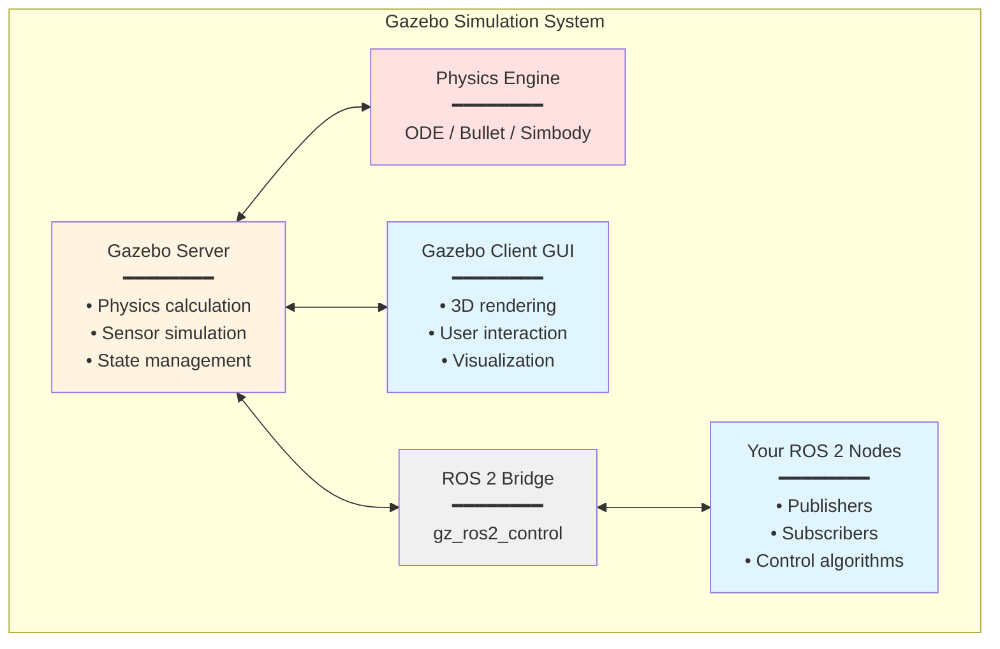
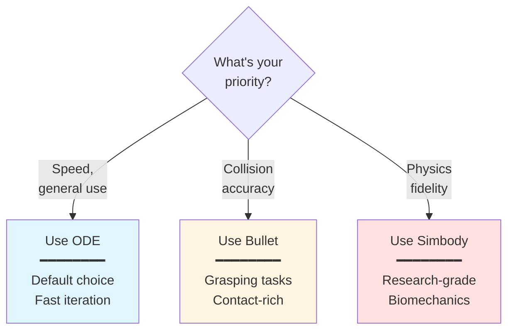
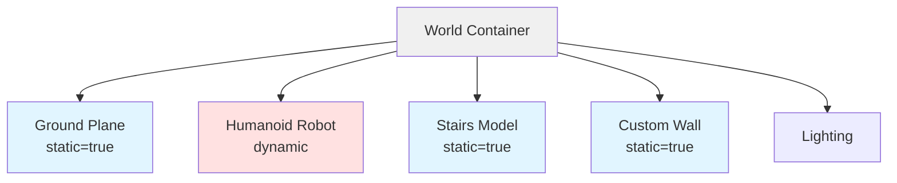

# Gazebo Simulation Basics: Physics-Based Testing

## Learning Objectives

After completing this chapter, you will be able to:

1. Explain what Gazebo is and why simulation is essential for robotics
2. Create Gazebo world files with physics configuration
3. Spawn URDF robot models into simulation environments
4. Choose appropriate physics engines for different scenarios
5. Build realistic environments with collisions and obstacles
6. Control simulated robots using ROS 2 topics

## Prerequisites

:::info Before You Begin

- **Module 1 completion**: Understanding of ROS 2 (nodes, topics, services) and URDF
- **Python proficiency**: Comfortable with rclpy from Module 1, Chapter 2
- **3D coordinates**: Basic understanding of XYZ coordinate systems

:::

---

## 1. Introduction: Why Simulation?

### The Hardware Testing Problem

Building and testing humanoid robots on real hardware is challenging:

| Challenge | Impact | Cost |
|-----------|--------|------|
| **Hardware cost** | Humanoid robots cost $50k-$500k+ | Prohibitive for students/researchers |
| **Damage risk** | Falls can break motors, sensors, frames | $1k-$10k per incident |
| **Iteration speed** | Setup, calibrate, test, fix, repeat | Hours per iteration |
| **Safety concerns** | Testing stairs, obstacles, crowds | Dangerous for robot and humans |
| **Reproducibility** | Initial conditions vary each run | Hard to debug intermittent issues |

**Simulation solves these problems** by providing a virtual sandbox where you can:

- ✅ Test algorithms infinitely at zero marginal cost
- ✅ Try dangerous scenarios safely (falls, collisions, extreme speeds)
- ✅ Reproduce exact conditions for debugging
- ✅ Iterate 10x-100x faster than hardware
- ✅ Develop algorithms before hardware exists

### What is Gazebo?

**Gazebo** is an open-source 3D robotics simulator that provides:

- **Physics simulation**: Gravity, collisions, friction, forces
- **Sensor simulation**: Cameras, LiDAR, IMU, force sensors
- **ROS 2 integration**: Native support for topics, services, actions
- **Rendering**: 3D visualization of robots and environments
- **Plugin system**: Extensible for custom sensors and behaviors

Think of Gazebo as a "physics lab" for robots - where you test how they move, balance, and interact with the world.

### Real-World Adoption

Gazebo powers algorithm development for:

- **Boston Dynamics**: Spot and Atlas use Gazebo for algorithm prototyping
- **NASA**: Robonaut 2 tested in Gazebo before ISS deployment
- **Clearpath Robotics**: All mobile robots simulated before customer delivery
- **Research labs worldwide**: Thousands of papers use Gazebo for validation

---

## 2. Gazebo Architecture Overview

### System Components

Gazebo uses a client-server architecture:



**Figure 1**: Gazebo architecture showing client-server separation. The server handles physics and sensors, the client provides visualization, and the ROS 2 bridge enables communication with your control nodes.

### How Components Interact

1. **Gazebo Server**: Runs the physics simulation loop
   - Calculates forces, torques, collisions
   - Updates robot and world state
   - Simulates sensors (cameras, LiDAR, IMU)

2. **Physics Engine**: Computes dynamics
   - Integrates equations of motion
   - Detects and resolves collisions
   - Applies constraints (joints, contacts)

3. **Gazebo Client (GUI)**: Visualizes simulation
   - Renders 3D scene
   - Displays robot models, environments
   - Provides user controls (pause, play, reset)

4. **ROS 2 Bridge**: Connects to your code
   - Publishes joint states, sensor data
   - Subscribes to joint commands, velocities
   - Enables standard ROS 2 workflows

### Headless Mode

You can run Gazebo without the GUI for faster simulation:

```bash
# With GUI (slower, visual feedback)
gz sim world.sdf

# Headless (faster, batch testing)
gz sim -s world.sdf
```

Headless mode is essential for:
- Batch testing (run 1000 trials overnight)
- Cloud/Docker deployments
- CI/CD pipelines
- Faster-than-real-time simulation

---

## 3. Creating Your First World

### World File Format

Gazebo worlds are defined in **SDF (Simulation Description Format)** XML files:

```xml
<?xml version="1.0"?>
<sdf version="1.8">
  <world name="empty_world">
    <!-- Physics configuration -->
    <physics name="default_physics" type="ode">
      <max_step_size>0.001</max_step_size>
      <real_time_factor>1.0</real_time_factor>
      <real_time_update_rate>1000</real_time_update_rate>
    </physics>

    <!-- Scene lighting -->
    <light name="sun" type="directional">
      <cast_shadows>true</cast_shadows>
      <pose>0 0 10 0 0 0</pose>
      <diffuse>0.8 0.8 0.8 1</diffuse>
      <specular>0.2 0.2 0.2 1</specular>
      <direction>-0.5 0.1 -0.9</direction>
    </light>

    <!-- Ground plane -->
    <model name="ground_plane">
      <static>true</static>
      <link name="link">
        <collision name="collision">
          <geometry>
            <plane>
              <normal>0 0 1</normal>
              <size>100 100</size>
            </plane>
          </geometry>
        </collision>
        <visual name="visual">
          <geometry>
            <plane>
              <normal>0 0 1</normal>
              <size>100 100</size>
            </plane>
          </geometry>
          <material>
            <ambient>0.8 0.8 0.8 1</ambient>
            <diffuse>0.8 0.8 0.8 1</diffuse>
          </material>
        </visual>
      </link>
    </model>
  </world>
</sdf>
```

**Save this as**: `empty_world.world`

### Key Elements Explained

- **`<world>`**: Top-level container
- **`<physics>`**: Engine configuration (timestep, real-time factor)
- **`<light>`**: Scene lighting (directional sun)
- **`<model>`**: Objects in the world (ground plane)
- **`<static>true`**: Object doesn't move (infinite mass)

### Launching Your World

```bash
# Launch Gazebo with custom world
gz sim empty_world.world

# Or specify full path
gz sim /path/to/your/empty_world.world
```

**Expected Result**: Gazebo opens showing an empty gray ground plane with lighting.

---

## 4. Physics Engines Explained

Gazebo supports three physics engines, each with trade-offs:

### Engine Comparison

| Engine | Accuracy | Speed | Best For |
|--------|----------|-------|----------|
| **ODE** (Default) | Medium | Fast | General robotics, mobile robots |
| **Bullet** | High (collisions) | Medium | Manipulation, grasping, contact-rich |
| **Simbody** | Very High | Slow | Biomechanics, research, high-fidelity |



**Figure 2**: Physics engine selection flowchart. ODE is the default for general robotics, Bullet excels at collision-heavy tasks, and Simbody provides research-grade accuracy at the cost of speed.

### Configuring Physics

```xml
<!-- ODE (default) -->
<physics name="default_physics" type="ode">
  <max_step_size>0.001</max_step_size>        <!-- 1ms timestep -->
  <real_time_factor>1.0</real_time_factor>    <!-- Target real-time -->
  <real_time_update_rate>1000</real_time_update_rate>  <!-- 1000 Hz -->
  <ode>
    <solver>
      <type>quick</type>                       <!-- Fast solver -->
      <iters>50</iters>                        <!-- Iterations per step -->
    </solver>
  </ode>
</physics>

<!-- Bullet (better collisions) -->
<physics name="bullet_physics" type="bullet">
  <max_step_size>0.001</max_step_size>
  <bullet>
    <solver>
      <type>sequential_impulse</type>
      <iters>50</iters>
    </solver>
  </bullet>
</physics>
```

### Real-Time Factor

**Real-time factor (RTF)** measures simulation speed:

- **RTF = 1.0**: Simulation runs at real-world speed (1 sec simulated = 1 sec wall-clock)
- **RTF < 1.0**: Slower than real-time (complex physics, need faster computer)
- **RTF > 1.0**: Faster than real-time (simple physics, headless mode)

**Goal**: Maintain RTF ≥ 1.0 for real-time control testing.

---

## 5. Spawning Robots from URDF

### Using the spawn_entity Script

Gazebo can spawn robots defined in URDF format directly:

```bash
# Basic spawn command
ros2 run gazebo_ros spawn_entity.py \
  -file /path/to/humanoid.urdf \
  -entity my_humanoid \
  -x 0 -y 0 -z 1.0

# With initial joint positions
ros2 run gazebo_ros spawn_entity.py \
  -file /path/to/humanoid.urdf \
  -entity my_humanoid \
  -x 0 -y 0 -z 1.0 \
  -J left_knee 0.5 \
  -J right_knee 0.5
```

**Parameters**:
- `-file`: Path to URDF file
- `-entity`: Robot name in simulation
- `-x`, `-y`, `-z`: Initial position (meters)
- `-R`, `-P`, `-Y`: Roll, Pitch, Yaw (radians)
- `-J joint_name value`: Set initial joint angle

### Python Spawn Script

For programmatic spawning:

```python
#!/usr/bin/env python3
"""
Spawn a humanoid robot into Gazebo simulation.
"""

import rclpy
from rclpy.node import Node
from gazebo_msgs.srv import SpawnEntity
import os


class RobotSpawner(Node):
    """Spawns a URDF robot model into Gazebo."""

    def __init__(self):
        super().__init__('robot_spawner')

        # Create service client
        self.spawn_client = self.create_client(
            SpawnEntity,
            '/spawn_entity'
        )

        # Wait for Gazebo to be ready
        while not self.spawn_client.wait_for_service(timeout_sec=1.0):
            self.get_logger().info('Waiting for Gazebo spawn service...')

        self.spawn_robot()

    def spawn_robot(self):
        """Load URDF and spawn robot."""
        # Read URDF file
        urdf_path = '/path/to/simple_humanoid.urdf'
        with open(urdf_path, 'r') as f:
            robot_xml = f.read()

        # Create spawn request
        request = SpawnEntity.Request()
        request.name = 'my_humanoid'
        request.xml = robot_xml
        request.robot_namespace = ''
        request.initial_pose.position.x = 0.0
        request.initial_pose.position.y = 0.0
        request.initial_pose.position.z = 1.0

        # Call spawn service
        future = self.spawn_client.call_async(request)
        rclpy.spin_until_future_complete(self, future)

        if future.result() is not None:
            self.get_logger().info(
                f'Robot spawned successfully: {future.result().status_message}'
            )
        else:
            self.get_logger().error('Failed to spawn robot')


def main(args=None):
    rclpy.init(args=args)
    spawner = RobotSpawner()
    spawner.destroy_node()
    rclpy.shutdown()


if __name__ == '__main__':
    main()
```

### Common Spawn Errors

| Error | Cause | Fix |
|-------|-------|-----|
| "Entity already exists" | Robot with same name present | Use unique `-entity` name or reset simulation |
| "Failed to build model" | URDF syntax error | Validate URDF with `check_urdf` command |
| "Robot falls through ground" | No collision geometry | Add `<collision>` elements to URDF links |
| "Joints don't move" | Missing joint limits | Add `<limit>` to each joint in URDF |

---

## 6. Collision Detection and Contact Forces

### Collision Geometries

Every link in your URDF needs a `<collision>` element for physics:

```xml
<link name="torso">
  <!-- Visual mesh (detailed) -->
  <visual>
    <geometry>
      <mesh filename="package://my_robot/meshes/torso.stl"/>
    </geometry>
  </visual>

  <!-- Collision shape (simplified for performance) -->
  <collision>
    <geometry>
      <box size="0.3 0.2 0.5"/>  <!-- Simple box instead of complex mesh -->
    </geometry>
  </collision>
</link>
```

:::warning Performance Critical

**Use simple collision shapes**: Boxes, cylinders, and spheres are 100x-1000x faster than mesh collisions.

- ✅ Visual mesh: 10,000 triangles (looks great)
- ✅ Collision box: 1 shape (simulates fast)
- ❌ Collision mesh: 10,000 triangles (simulation crawls)

Complex collision meshes are the #1 cause of slow simulation.

:::

### Contact Sensors

To detect when robot touches something:

```xml
<gazebo reference="left_foot">
  <sensor name="left_foot_contact" type="contact">
    <contact>
      <collision>left_foot_collision</collision>
    </contact>
    <plugin name="contact_plugin" filename="libgazebo_ros_bumper.so">
      <ros>
        <remapping>~/out:=left_foot/contact</remapping>
      </ros>
    </plugin>
    <update_rate>100</update_rate>
  </sensor>
</gazebo>
```

Publishes to `/left_foot/contact` when foot touches ground or obstacles.

---

## 7. Building Environments

### Adding Objects from Model Database

Gazebo has a library of pre-built models:

```xml
<world name="warehouse">
  <!-- Include pre-made models -->
  <include>
    <uri>model://ground_plane</uri>
  </include>

  <include>
    <uri>model://sun</uri>
  </include>

  <!-- Add stairs at specific location -->
  <include>
    <uri>model://stairs</uri>
    <pose>5 0 0 0 0 0</pose>  <!-- x y z roll pitch yaw -->
  </include>

  <!-- Add box obstacle -->
  <include>
    <uri>model://cardboard_box</uri>
    <pose>2 1 0.5 0 0 0</pose>
  </include>
</world>
```

### Custom Environment Objects

Create your own obstacles:

```xml
<model name="custom_wall">
  <static>true</static>
  <pose>3 0 1 0 0 0</pose>
  <link name="link">
    <collision name="collision">
      <geometry>
        <box size="0.1 5 2"/>  <!-- Thin wall: 10cm thick, 5m wide, 2m tall -->
      </geometry>
    </collision>
    <visual name="visual">
      <geometry>
        <box size="0.1 5 2"/>
      </geometry>
      <material>
        <ambient>0.7 0.7 0.7 1</ambient>
      </material>
    </visual>
  </link>
</model>
```



**Figure 3**: World structure hierarchy. Static models (ground, walls, stairs) don't move, while dynamic models (robot) respond to physics.

---

## 8. Controlling Robots in Simulation

### ROS 2 Integration via gz_ros2_control

Add this to your URDF to enable ROS 2 control:

```xml
<gazebo>
  <plugin filename="gz_ros2_control-system" name="gz_ros2_control::GazeboSimROS2ControlPlugin">
    <parameters>$(find my_robot)/config/controllers.yaml</parameters>
  </plugin>
</gazebo>
```

### Controlling Joints with Python

```python
#!/usr/bin/env python3
"""
Control a humanoid robot in Gazebo simulation.
Make the robot stand up by commanding joint positions.
"""

import rclpy
from rclpy.node import Node
from trajectory_msgs.msg import JointTrajectory, JointTrajectoryPoint
from builtin_interfaces.msg import Duration


class HumanoidController(Node):
    """Commands humanoid to standing pose."""

    def __init__(self):
        super().__init__('humanoid_controller')

        # Publisher for joint commands
        self.joint_pub = self.create_publisher(
            JointTrajectory,
            '/joint_trajectory_controller/joint_trajectory',
            10
        )

        # Wait for simulation to start
        self.timer = self.create_timer(2.0, self.send_stand_command)

    def send_stand_command(self):
        """Send joint positions for standing pose."""
        self.timer.cancel()  # Run once

        msg = JointTrajectory()

        # Joint names (must match URDF)
        msg.joint_names = [
            'left_hip_pitch',
            'left_knee',
            'left_ankle_pitch',
            'right_hip_pitch',
            'right_knee',
            'right_ankle_pitch'
        ]

        # Standing pose (angles in radians)
        point = JointTrajectoryPoint()
        point.positions = [
            -0.1,  # left_hip: slight bend
            0.2,   # left_knee: slight bend
            -0.1,  # left_ankle: balance
            -0.1,  # right_hip
            0.2,   # right_knee
            -0.1   # right_ankle
        ]
        point.time_from_start = Duration(sec=2, nanosec=0)

        msg.points = [point]

        self.joint_pub.publish(msg)
        self.get_logger().info('Stand command sent!')


def main(args=None):
    rclpy.init(args=args)
    controller = HumanoidController()

    try:
        rclpy.spin(controller)
    except KeyboardInterrupt:
        pass
    finally:
        controller.destroy_node()
        rclpy.shutdown()


if __name__ == '__main__':
    main()
```

### Complete Workflow

1. **Terminal 1**: Launch Gazebo with world
   ```bash
   gz sim empty_world.world
   ```

2. **Terminal 2**: Spawn humanoid robot
   ```bash
   ros2 run gazebo_ros spawn_entity.py \
     -file simple_humanoid.urdf \
     -entity humanoid -z 1.0
   ```

3. **Terminal 3**: Run control node
   ```bash
   python3 humanoid_controller.py
   ```

**Expected Behavior**:
- Robot spawns upright at 1m height
- Gravity pulls robot down to ground
- After 2 seconds, joints move to standing pose
- Robot maintains balance on ground plane

---

## 9. Complete Example: Humanoid Standing

### Scenario

Spawn a humanoid robot and command it to a stable standing pose while observing physics.

### Step-by-Step

**Step 1**: Create world file (`test_world.world`) with ground and light (use empty_world.world from Section 3)

**Step 2**: Ensure your URDF has:
- Collision geometries on all links
- Joint limits defined
- Reasonable mass/inertia values

**Step 3**: Launch simulation:
```bash
gz sim test_world.world
```

**Step 4**: Spawn robot:
```bash
ros2 run gazebo_ros spawn_entity.py \
  -file simple_humanoid.urdf \
  -entity standing_humanoid \
  -z 1.0
```

**Step 5**: Observe physics:
- Robot falls from 1m height
- Ground collision stops fall
- Robot settles into resting pose

**Step 6**: Command standing pose:
```bash
# Run controller from Section 8
python3 humanoid_controller.py
```

### What to Observe

- **Gravity**: Robot accelerates downward at 9.81 m/s²
- **Collision**: Ground prevents robot from falling through
- **Joint control**: Motors move joints to target positions
- **Balance**: Robot may fall over if pose is unstable (this is realistic!)

### Troubleshooting

| Issue | Likely Cause | Solution |
|-------|--------------|----------|
| Robot explodes on spawn | Joint limits too tight | Loosen limits in URDF |
| Robot falls through ground | Missing collision | Add collision geometries |
| Joints don't respond | Controller not connected | Check topic names match |
| Simulation very slow (RTF < 0.5) | Complex collision meshes | Simplify to boxes/cylinders |

---

## 10. Best Practices and Performance

### Performance Optimization

**Target**: RTF ≥ 1.0 for real-time simulation

**Optimization Strategies**:

1. **Simplify collision geometries**
   - Use boxes, cylinders, spheres instead of meshes
   - Result: 10x-100x speedup

2. **Increase physics timestep**
   ```xml
   <max_step_size>0.002</max_step_size>  <!-- 2ms instead of 1ms -->
   ```
   - Fewer physics iterations per second
   - Trade-off: Slight accuracy loss

3. **Run headless mode**
   ```bash
   gz sim -s world.sdf  # No GUI rendering
   ```
   - No graphics overhead
   - Can achieve RTF > 1.0 for batch testing

4. **Reduce model complexity**
   - Fewer links/joints where possible
   - Merge fixed joints into single links

:::tip Batch Testing

For overnight algorithm testing:

```bash
# Run 1000 trials headless
for i in {1..1000}; do
  gz sim -s test_world.sdf &
  sleep 60  # 1-minute trial
  pkill -f "gz sim"
  # Process results
done
```

Headless Gazebo can run faster than real-time for rapid iteration.

:::

### Debugging Tools

```bash
# List all models in simulation
gz model --list

# Get model info
gz model --info my_humanoid

# Monitor topic list
ros2 topic list

# Check joint states
ros2 topic echo /joint_states
```

---

## 11. Summary / Key Takeaways

**Core Concepts**:

- Gazebo provides physics-accurate simulation for safe, repeatable robot testing
- World files (SDF XML) define environments, physics settings, and initial objects
- Physics engines (ODE, Bullet, Simbody) trade off speed vs accuracy
- URDF models from Module 1 spawn directly into Gazebo with `spawn_entity.py`
- ROS 2 integration (gz_ros2_control) enables control like real robots
- Collision geometries must be simple (boxes, spheres) for good performance
- Real-time factor (RTF) measures simulation speed - target ≥ 1.0
- Headless mode enables faster-than-real-time batch testing

**Practical Skills Gained**:

- Create Gazebo worlds with custom physics and lighting
- Spawn humanoid URDF models at specific poses
- Control simulated robots via ROS 2 topics
- Optimize simulation performance for real-time operation
- Debug common simulation issues

**Next Chapter Preview**:

You can now test robot physics and control algorithms in Gazebo. In **Chapter 2**, you'll learn how to use **Unity** for photorealistic rendering, human-robot interaction, and creating demo-quality visualizations that go beyond Gazebo's capabilities.

---

## 12. Self-Assessment Questions

**Question 1** (Easy):
What are the three main physics engines supported by Gazebo?

<details>
<summary>Answer</summary>

**A) ODE, Bullet, Simbody** ✅

Gazebo supports ODE (default, fast), Bullet (better collision detection), and Simbody (high-fidelity, slower).

</details>

---

**Question 2** (Easy):
Why should you use simple collision geometries (boxes, spheres) instead of detailed meshes?

<details>
<summary>Answer</summary>

Simple collision geometries compute 100x-1000x faster than complex meshes, dramatically improving simulation real-time factor. Use detailed meshes for visuals, simple shapes for collisions.

</details>

---

**Question 3** (Medium):
You spawn a humanoid robot but it immediately falls through the ground. What are two likely causes?

<details>
<summary>Answer</summary>

1. **No ground plane** defined in world file (missing `<model name="ground_plane">`)
2. **Missing collision properties** on robot links or ground (no `<collision>` elements)

</details>

---

**Question 4** (Medium):
When would you choose Bullet physics over ODE?

<details>
<summary>Answer</summary>

Use Bullet when **accurate collision detection** is critical, such as:
- Grasping and manipulation tasks
- Contact-rich interactions (picking up objects)
- Dense obstacle environments

Bullet has better collision algorithms than ODE, though it's slightly slower.

</details>

---

**Question 5** (Hard):
Your simulation runs at 0.5x real-time factor (too slow). List three specific optimization strategies and explain why each helps.

<details>
<summary>Answer</summary>

1. **Simplify collision meshes** → Use boxes/cylinders instead of STL meshes. Reduces collision detection computation (largest bottleneck).

2. **Increase physics timestep** → Change `<max_step_size>` from 0.001 to 0.002. Fewer physics iterations per second (trade-off: slight accuracy loss).

3. **Run headless mode** → Use `gz sim -s` instead of `gz sim`. Eliminates GUI rendering overhead (graphics consume 30-50% of CPU).

Bonus: Reduce sensor update rates (e.g., LiDAR from 100Hz to 10Hz if algorithms allow).

</details>

---

## Additional Resources

- [Gazebo Official Documentation](https://gazebosim.org/docs) - Complete reference and tutorials
- [SDF Format Specification](http://sdformat.org/spec) - World and model file syntax
- [gz_ros2_control Plugin](https://github.com/ros-controls/gz_ros2_control) - ROS 2 control integration
- [Gazebo Model Library](https://app.gazebosim.org/fuel/models) - Community-contributed models

---

*Ready for photorealistic rendering? Continue to [Chapter 2: Unity for Robotics](./02-unity-digital-twin.md)*
