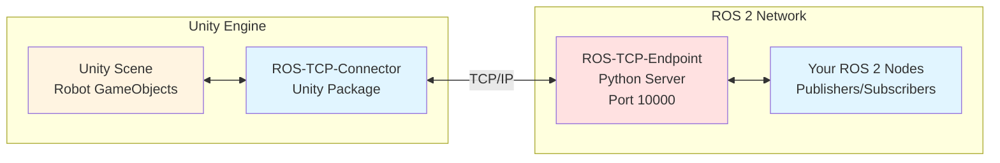
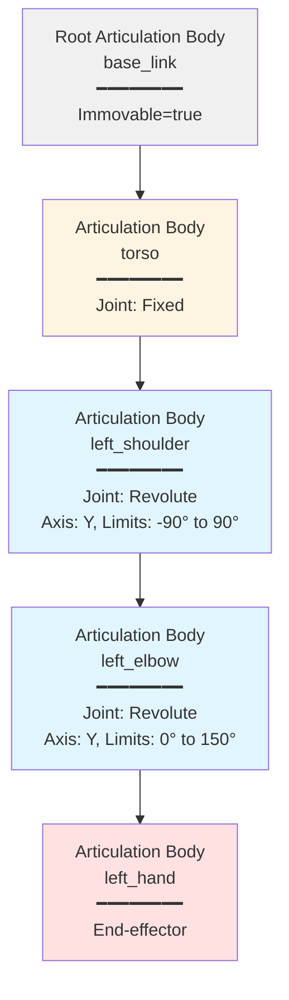
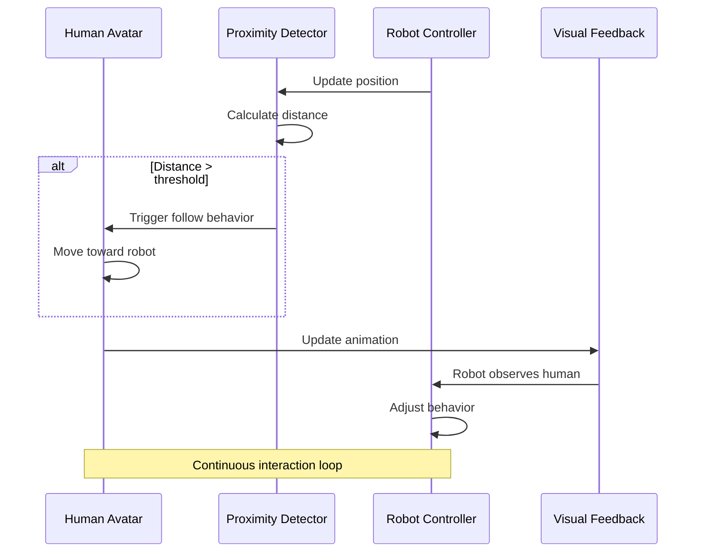

# Unity for Robotics: High-Fidelity Digital Twins

## Learning Objectives

After completing this chapter, you will be able to:

1. Explain Unity's strengths for robotics visualization vs Gazebo
2. Set up Unity with the Unity Robotics Hub for ROS 2 integration
3. Import URDF robot models into Unity scenes
4. Configure Articulation Bodies for robot joint simulation
5. Create photorealistic environments with lighting and materials
6. Add human avatars and script basic interactions
7. Optimize Unity performance for real-time simulation

## Prerequisites

:::info Before You Begin

- **Chapter 1 completion**: Understanding of Gazebo and physics simulation
- **Module 1 knowledge**: ROS 2 (topics, services) and URDF structure
- **System requirements**: 16GB RAM, dedicated GPU, Unity 2022.3 LTS installed

:::

---

## 1. Introduction: Beyond Physics Simulation

### What Unity Brings to Robotics

Gazebo excels at physics accuracy, but robots need more than physics:

- **Photorealistic rendering** for demonstrations and videos
- **Human avatars** for testing social robotics and HRI
- **VR/AR integration** for immersive experiences
- **Asset ecosystems** for environments (Unity Asset Store)
- **Real-time ray tracing** for synthetic training data generation

### Gazebo vs Unity: When to Use Each

| Aspect | Gazebo | Unity |
|--------|--------|-------|
| **Physics Fidelity** | High (robotics-grade ODE/Bullet) | Good (PhysX, game-engine) |
| **Visual Quality** | Basic (functional rendering) | Photorealistic (AAA game-quality) |
| **Performance Focus** | Real-time physics | Real-time rendering (30-60 FPS) |
| **ROS 2 Integration** | Native (gz_ros2_control) | Via Unity Robotics Hub |
| **Best Use Cases** | Algorithm development, testing | Demos, user studies, visualization |
| **Learning Curve** | Medium (XML configuration) | Medium-High (Unity Editor + C#) |
| **Free Tier** | Fully open-source | Personal Edition (free) |

:::tip When to Use Each

**Use Gazebo when**:
- Physics accuracy is critical (manipulation, bipedal walking)
- Iterating on control algorithms rapidly
- Running headless batch tests
- Working purely in ROS 2 ecosystem

**Use Unity when**:
- Creating demos for stakeholders or publications
- Testing human-robot interaction scenarios
- Generating synthetic training data for ML
- VR/AR visualization is needed

**Use Both together**:
- Develop algorithms in Gazebo (fast iteration)
- Validate in Unity (realistic visualization)
- Parallel workflows: control team (Gazebo) + UX team (Unity)

:::

---

## 2. Unity Robotics Hub Overview

### What is Unity Robotics Hub?

**Unity Robotics Hub** is an official Unity package that bridges Unity and ROS 2:

- **ROS-TCP-Connector** (Unity side): Sends/receives ROS messages
- **ROS-TCP-Endpoint** (ROS 2 side): Python server for TCP communication
- **URDF Importer**: Converts URDF files to Unity GameObjects
- **Articulation Body support**: Maps URDF joints to Unity physics



**Figure 4**: Unity Robotics Hub architecture. The TCP connector in Unity communicates with a Python endpoint server, which bridges to the ROS 2 network.

### Why TCP Instead of DDS?

Unity runs on Windows/Mac/Linux but DDS (ROS 2's middleware) has platform compatibility issues. TCP provides:
- Cross-platform reliability
- Simpler Unity integration
- Firewall-friendly communication
- Good performance for visualization use cases

---

## 3. Setting Up Unity for Robotics

### Installation Steps

**1. Install Unity Hub and Unity 2022.3 LTS**

Download Unity Hub from https://unity.com/download, then install Unity 2022.3 LTS.

**2. Create New Project**

- Template: **3D (URP)** - Universal Render Pipeline for better graphics
- Name: `humanoid_digital_twin`

**3. Install Unity Robotics Hub Packages**

In Unity Editor:
- **Window** → **Package Manager**
- **+** (top-left) → **Add package from git URL**
- Paste: `https://github.com/Unity-Technologies/ROS-TCP-Connector.git?path=/com.unity.robotics.ros-tcp-connector`
- Wait for installation, then repeat for URDF Importer:
- Paste: `https://github.com/Unity-Technologies/URDF-Importer.git?path=/com.unity.robotics.urdf-importer`

**4. Install ROS-TCP-Endpoint (ROS 2 Side)**

```bash
# In your ROS 2 workspace
cd ~/ros2_ws/src
git clone https://github.com/Unity-Technologies/ROS-TCP-Endpoint
cd ~/ros2_ws
colcon build --packages-select ros_tcp_endpoint
source install/setup.bash

# Run the endpoint server
ros2 run ros_tcp_endpoint default_server_endpoint --ros-args -p ROS_IP:=127.0.0.1
```

**Expected output**: `Server listening on 127.0.0.1:10000`

**5. Configure Unity Connection**

In Unity:
- **Robotics** → **ROS Settings**
- **ROS IP Address**: `127.0.0.1`
- **ROS Port**: `10000`
- **Protocol**: `ROS 2`

**6. Test Connection**

Create a test script:

```csharp
using UnityEngine;
using Unity.Robotics.ROSTCPConnector;
using RosMessageTypes.Std;

public class ROSConnectionTest : MonoBehaviour
{
    void Start()
    {
        // Connect to ROS 2
        ROSConnection.GetOrCreateInstance()
            .ConnectOnStart("127.0.0.1", 10000);

        Debug.Log("ROS connection initiated!");

        // Test publish
        ROSConnection.GetOrCreateInstance()
            .RegisterPublisher<StringMsg>("unity_test");

        StringMsg msg = new StringMsg("Hello from Unity!");
        ROSConnection.GetOrCreateInstance()
            .Publish("unity_test", msg);
    }
}
```

Attach to any GameObject, press Play, then check ROS 2:

```bash
ros2 topic echo /unity_test
```

**Expected**: You should see "Hello from Unity!"

---

## 4. Importing URDF Models into Unity

### Using the URDF Importer

**Step 1**: In Unity, go to **Assets** → **Import Robot from URDF**

**Step 2**: Select your humanoid URDF file (from Module 1)

**Step 3**: Configure import settings:
- **Axis Type**: Y-axis (Unity convention)
- **Mesh Decomposition**: Convex for collisions

**Step 4**: Click **Import**

### What Happens During Import

```
URDF Format              →  Unity GameObjects
━━━━━━━━━━━━━━━━━━━━━━━━━━━━━━━━━━━━━━━━━━━━━━━
<link name="torso">      →  GameObject "torso"
  <visual>               →  MeshRenderer + MeshFilter
  <collision>            →  Collider (BoxCollider, etc.)
  <inertial>             →  ArticulationBody (mass, inertia)

<joint name="shoulder">  →  ArticulationBody (joint config)
  <parent>               →  GameObject hierarchy (parent-child)
  <child>                →
  <axis>                 →  Joint axis configuration
  <limit>                →  Joint limits (lower, upper)
```

:::warning Coordinate System Conversion

Unity uses **Y-up** (Y-axis points up), while ROS 2/Gazebo use **Z-up**.

The URDF Importer automatically converts:
- URDF Z-up → Unity Y-up
- Rotations adjusted accordingly

Check joint orientations after import to ensure correct behavior.

:::

---

## 5. Articulation Bodies: Unity's Physics for Robots

### What Are Articulation Bodies?

**Articulation Bodies** are Unity's answer to multi-body dynamics (robots with joints). They replace Rigidbodies for connected systems.

**Key features**:
- Stable joint simulation (no "exploding" robots)
- Position, velocity, and force control
- Reduced joints (tree structure only, no loops)
- Better performance than Rigidbody chains



**Figure 5**: Articulation Body hierarchy for a humanoid arm. The root is immovable, and each child has a joint configuration defining its motion relative to the parent.

### Configuring Joint Control

```csharp
using UnityEngine;

public class JointController : MonoBehaviour
{
    private ArticulationBody shoulder;

    void Start()
    {
        shoulder = GetComponent<ArticulationBody>();

        // Configure joint drive (position control)
        var drive = shoulder.xDrive;
        drive.stiffness = 10000;      // Spring constant
        drive.damping = 100;          // Damping coefficient
        drive.forceLimit = 50;        // Max torque (Nm)
        drive.target = 45.0f;         // Target angle (degrees)

        shoulder.xDrive = drive;
    }

    void Update()
    {
        // Dynamically change target
        if (Input.GetKeyDown(KeyCode.Space))
        {
            var drive = shoulder.xDrive;
            drive.target = drive.target > 0 ? -45.0f : 45.0f;
            shoulder.xDrive = drive;

            Debug.Log($"Shoulder target: {drive.target}°");
        }
    }
}
```

**Control Modes**:
- **Position control**: Set `target` angle (most common)
- **Velocity control**: Set `targetVelocity` (rad/s)
- **Force control**: Set `target` and use `forceLimit`

---

## 6. ROS 2 Communication in Unity

### Publishing Robot State to ROS 2

```csharp
using UnityEngine;
using Unity.Robotics.ROSTCPConnector;
using RosMessageTypes.Sensor;

public class JointStatePublisher : MonoBehaviour
{
    public ArticulationBody[] joints;
    public float publishRate = 10.0f;

    private ROSConnection ros;
    private float timer;

    void Start()
    {
        ros = ROSConnection.GetOrCreateInstance();
        ros.RegisterPublisher<JointStateMsg>("joint_states");
    }

    void FixedUpdate()
    {
        timer += Time.fixedDeltaTime;

        if (timer >= 1.0f / publishRate)
        {
            timer = 0;
            PublishJointStates();
        }
    }

    void PublishJointStates()
    {
        JointStateMsg msg = new JointStateMsg();

        msg.name = new string[joints.Length];
        msg.position = new double[joints.Length];
        msg.velocity = new double[joints.Length];

        for (int i = 0; i < joints.Length; i++)
        {
            msg.name[i] = joints[i].name;
            msg.position[i] = joints[i].jointPosition[0];
            msg.velocity[i] = joints[i].jointVelocity[0];
        }

        msg.header.stamp = new RosMessageTypes.Std.TimeMsg
        {
            sec = (int)Time.time,
            nanosec = (uint)((Time.time % 1) * 1e9)
        };

        ros.Publish("joint_states", msg);
    }
}
```

### Subscribing to Joint Commands

```csharp
using UnityEngine;
using Unity.Robotics.ROSTCPConnector;
using RosMessageTypes.Trajectory;

public class JointCommandSubscriber : MonoBehaviour
{
    public ArticulationBody[] joints;

    void Start()
    {
        ROSConnection.GetOrCreateInstance()
            .Subscribe<JointTrajectoryMsg>("joint_commands", HandleJointCommand);
    }

    void HandleJointCommand(JointTrajectoryMsg msg)
    {
        if (msg.points.Length == 0) return;

        // Use first trajectory point
        var point = msg.points[0];

        // Apply positions to joints
        for (int i = 0; i < joints.Length && i < point.positions.Length; i++)
        {
            var drive = joints[i].xDrive;
            drive.target = (float)(point.positions[i] * Mathf.Rad2Deg);
            joints[i].xDrive = drive;
        }

        Debug.Log($"Joint command received: {point.positions.Length} joints");
    }
}
```

---

## 7. Creating Photorealistic Environments

### Universal Render Pipeline (URP)

Unity's URP provides high-quality graphics optimized for real-time:

**1. Lighting Setup**

Use **HDRI skyboxes** for realistic lighting:

```
Assets → Import Package → Custom Package
Download HDRI from polyhaven.com
Drag into scene as Skybox Material
```

**2. Post-Processing**

Add cinematic effects:

- **Window** → **Rendering** → **Lighting**
- Create **Global Volume** GameObject
- Add **Volume** component
- Add overrides:
  - **Bloom**: Glowing lights
  - **Ambient Occlusion**: Contact shadows
  - **Color Grading**: Cinematic look

**3. PBR Materials**

Use Physically Based Rendering for realistic surfaces:

```csharp
// Metallic surfaces (robot parts)
Material robotMetal = new Material(Shader.Find("Universal Render Pipeline/Lit"));
robotMetal.SetFloat("_Metallic", 0.8f);
robotMetal.SetFloat("_Smoothness", 0.6f);
robotMetal.SetColor("_BaseColor", new Color(0.7f, 0.7f, 0.8f));

// Assign to robot mesh
GetComponent<MeshRenderer>().material = robotMetal;
```

:::tip Performance Optimization

Enable these for better performance:
- **GPU Instancing** on materials (Edit → Project Settings → Graphics)
- **Occlusion Culling** (Window → Rendering → Occlusion Culling)
- **LOD Groups** for complex models (Level of Detail)

Target: **30-60 FPS** for real-time interaction.

:::

---

## 8. Human-Robot Interaction

### Adding Human Avatars

**Option 1: Mixamo (Free)**

1. Go to mixamo.com (Adobe account required, free)
2. Download character FBX with animations
3. Import to Unity: **Assets** → **Import New Asset**
4. Drag character into scene

**Option 2: Ready Player Me (Free)**

1. Go to readyplayer.me
2. Create custom avatar
3. Download GLB file
4. Import to Unity

### Scripting Basic Interactions

```csharp
using UnityEngine;

public class HumanFollower : MonoBehaviour
{
    public Transform robot;
    public float followDistance = 2.0f;
    public float moveSpeed = 1.5f;

    void Update()
    {
        // Calculate direction to robot
        Vector3 direction = robot.position - transform.position;
        direction.y = 0;  // Stay on ground

        float distance = direction.magnitude;

        // Follow robot if too far
        if (distance > followDistance)
        {
            Vector3 moveDir = direction.normalized;
            transform.position += moveDir * moveSpeed * Time.deltaTime;

            // Face the robot
            transform.LookAt(new Vector3(
                robot.position.x,
                transform.position.y,
                robot.position.z
            ));
        }
    }
}
```



**Figure 6**: Human-robot interaction loop. The human avatar detects robot proximity and responds with movement/animation, while the robot can adjust its behavior based on human presence.

### Example: Handshake Scenario

```csharp
public class HandshakeInteraction : MonoBehaviour
{
    public Transform robotHand;
    public Transform humanHand;
    public Animator humanAnimator;

    private bool handshakeTriggered = false;

    void Update()
    {
        float distance = Vector3.Distance(robotHand.position, humanHand.position);

        // Trigger handshake when robot hand gets close
        if (distance < 0.3f && !handshakeTriggered)
        {
            handshakeTriggered = true;
            humanAnimator.SetTrigger("Handshake");
            Debug.Log("Handshake interaction started!");
        }

        // Reset when hands move apart
        if (distance > 0.5f && handshakeTriggered)
        {
            handshakeTriggered = false;
        }
    }
}
```

---

## 9. Performance Optimization

### Unity Profiler

**Window** → **Analysis** → **Profiler**

Monitor:
- **CPU Usage**: Target < 16ms per frame (60 FPS)
- **GPU Usage**: Rendering time
- **Physics**: Articulation Body computation
- **Scripts**: Your C# code execution time

### Optimization Techniques

**1. Reduce Polygon Count**

```csharp
// Use LOD (Level of Detail) groups
LODGroup lodGroup = gameObject.AddComponent<LODGroup>();

// High detail (close): Full mesh
// Medium detail (mid): 50% poly count
// Low detail (far): 10% poly count
```

**2. Optimize Physics Timestep**

**Edit** → **Project Settings** → **Time**
- **Fixed Timestep**: 0.02 (50 Hz physics, default is 0.02)
- Increase to 0.04 (25 Hz) if physics accuracy allows

**3. Simplify Colliders**

```csharp
// Instead of MeshCollider (slow):
gameObject.AddComponent<MeshCollider>();

// Use primitive colliders (fast):
gameObject.AddComponent<BoxCollider>();     // For box-shaped parts
gameObject.AddComponent<CapsuleCollider>(); // For cylindrical limbs
```

**4. Bake Lighting**

Static lighting (pre-calculated) is much faster than real-time:

- Mark environment objects as **Static**
- **Window** → **Rendering** → **Lighting** → **Generate Lighting**

:::warning Real-Time Demands

Unity simulation combines:
- **Real-time physics** (Articulation Bodies)
- **Real-time rendering** (30-60 FPS graphics)

This is computationally intensive! Test on target hardware early. If performance is poor:
1. Reduce graphics quality (shadows, post-processing)
2. Simplify robot model (fewer Articulation Bodies)
3. Lower Fixed Timestep (less frequent physics updates)

:::

---

## 10. Complete Example: Humanoid in Virtual Lab

### Scenario

Create a Unity scene with:
- Humanoid robot imported from URDF
- Photorealistic lab environment
- Human avatar that waves at the robot
- ROS 2 connection for robot control

### Setup Steps

**1. Import Robot**

- **Assets** → **Import Robot from URDF**
- Select `simple_humanoid.urdf` from Module 1
- Position at origin (0, 0, 0)

**2. Create Environment**

- Add **Plane** (GameObject → 3D Object → Plane) for floor
- Scale to 10×10 units
- Apply gray material with PBR properties

**3. Add Human Avatar**

- Import Mixamo character
- Place at (3, 0, 0) facing robot
- Add Animator with "Waving" animation

**4. Setup Lighting**

- Add **Directional Light** (simulates sun)
- Add **Post-Processing Volume** with Bloom and AO

**5. Connect ROS 2**

- Attach `JointStatePublisher` script to robot root
- Assign all Articulation Bodies to joints array
- Configure ROS Settings (127.0.0.1:10000)

**6. Test**

Press **Play** in Unity, then from terminal:

```bash
# Check joint states publishing
ros2 topic echo /joint_states

# Send walk command (if controller setup)
ros2 topic pub /cmd_vel geometry_msgs/Twist "..."
```

**Expected Behavior**:
- Robot stands in Unity scene with realistic lighting
- Human avatar waves at robot
- Joint states publish to ROS 2 at 10 Hz
- Graphics render at 30-60 FPS

---

## 11. Summary / Key Takeaways

**Core Concepts**:

- Unity provides photorealistic rendering beyond Gazebo's capabilities
- Unity Robotics Hub (ROS-TCP-Connector + Endpoint) bridges Unity and ROS 2 via TCP
- Articulation Bodies simulate robot joints with position/velocity/force control
- URDF models import directly into Unity with coordinate system conversion (Z-up → Y-up)
- URP (Universal Render Pipeline) enables AAA game-quality graphics
- Human avatars from Mixamo/Ready Player Me enable HRI testing
- Performance optimization is critical: Target 30-60 FPS for real-time interaction
- Use Gazebo for algorithm development, Unity for visualization and demos

**When to Choose Unity**:

- Creating demonstrations for stakeholders
- User studies with real humans observing robot
- VR/AR applications
- Synthetic data generation for ML (realistic images)
- Any scenario where visual fidelity matters

**Next Chapter Preview**:

You can now create physics-accurate simulations (Gazebo) and photorealistic digital twins (Unity). In **Chapter 3**, you'll learn to add **virtual sensors** (LiDAR, cameras, IMUs) to both environments, completing the perception-action loop for autonomous robot development.

---

## 12. Self-Assessment Questions

**Question 1** (Easy):
What is the primary advantage of Unity over Gazebo for robotics?

<details>
<summary>Answer</summary>

**B) Photorealistic rendering and human-robot interaction** ✅

Unity excels at visual fidelity (game-engine rendering) and has tools for human avatars and social robotics scenarios, while Gazebo focuses on physics accuracy.

</details>

---

**Question 2** (Easy):
What Unity component corresponds to a robot joint from URDF?

<details>
<summary>Answer</summary>

**Articulation Body** - Unity's component for simulating multi-body dynamics with joints. It replaces Rigidbody for connected systems and provides stable joint simulation with position/velocity/force control.

</details>

---

**Question 3** (Medium):
You import a humanoid URDF into Unity but the robot falls apart immediately. What are two likely causes?

<details>
<summary>Answer</summary>

1. **Articulation Body hierarchy not properly connected** - Parent-child relationships from URDF didn't transfer correctly. Check GameObject hierarchy matches URDF structure.

2. **Joint drives not configured** - Articulation Bodies need stiffness and damping values. If both are zero, joints have no resistance and collapse.

</details>

---

**Question 4** (Medium):
When would you use Unity instead of Gazebo for testing a bipedal walking algorithm?

<details>
<summary>Answer</summary>

Use **Unity for demonstration/visualization**, not primary algorithm development:

1. **After Gazebo validation**: Develop and test walking in Gazebo first (accurate physics), then visualize in Unity for stakeholder demos.

2. **For user studies**: Test human reactions to robot walking (e.g., "does this gait look natural?") using Unity's photorealistic rendering.

3. **For video/photos**: Create publication-quality visualizations of walking behavior.

**Bottom line**: Gazebo for development, Unity for communication.

</details>

---

**Question 5** (Hard):
Your Unity simulation runs at 15 FPS (target: 60 FPS). The Profiler shows "Physics" taking 60% of frame time. List three specific optimizations and explain why each helps.

<details>
<summary>Answer</summary>

1. **Increase Fixed Timestep** (Edit → Project Settings → Time → Fixed Timestep: 0.02 → 0.04)
   - **Why**: Physics updates less frequently (from 50 Hz to 25 Hz), reducing computation per frame. Trade-off: slight accuracy loss.

2. **Simplify collision geometry** on robot links (use BoxCollider/CapsuleCollider instead of MeshCollider)
   - **Why**: Primitive colliders compute 100x faster than mesh collisions. Most robot links can approximate as boxes/capsules.

3. **Reduce Articulation Body count** by merging non-moving parts
   - **Why**: Each Articulation Body has computational overhead. If some links never move relative to each other, merge them into single static colliders.

Bonus: Lower solver iteration count (Articulation Body → Solver Iterations: 10 → 5) if stability allows.

</details>

---

## Additional Resources

- [Unity Robotics Hub GitHub](https://github.com/Unity-Technologies/Unity-Robotics-Hub) - Official repository and tutorials
- [Unity Articulation Bodies Documentation](https://docs.unity3d.com/Manual/class-ArticulationBody.html) - Physics reference
- [ROS-TCP-Connector](https://github.com/Unity-Technologies/ROS-TCP-Connector) - Message passing implementation
- [Unity Learn: Robotics Hub Tutorials](https://learn.unity.com/course/unity-robotics-hub) - Video tutorials

---

*Ready to add sensors to your digital twin? Continue to [Chapter 3: Sensor Simulation](./03-sensor-simulation.md)*
