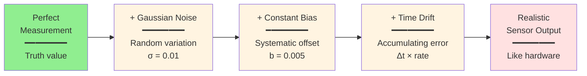

# Sensor Simulation: LiDAR, Cameras, and IMUs

## Learning Objectives

After completing this chapter, you will be able to:

1. Explain why sensor simulation is critical for perception development
2. Add LiDAR sensors to robot models in Gazebo with configuration
3. Add depth cameras and IMUs to robots in both Gazebo and Unity
4. Configure sensor parameters (range, resolution, noise) for realism
5. Subscribe to sensor topics in ROS 2 and process data
6. Build complete perception pipelines (sensor → processing → action)

## Prerequisites

:::info Before You Begin

- **Chapters 1-2 completion**: Gazebo simulation and Unity setup
- **Module 1, Chapter 2**: ROS 2 Python (subscribers, callbacks)
- **Understanding of**: 3D point clouds, image formats, orientation quaternions

:::

---

## 1. Introduction: Why Simulate Sensors?

### The Perception Development Problem

Testing perception algorithms on real sensors is challenging:

| Challenge | Impact | Solution in Simulation |
|-----------|--------|----------------------|
| **Hardware cost** | LiDAR costs $1k-$10k, depth cameras $200-$1k | Virtual sensors = $0 |
| **Iteration speed** | Mount sensor, calibrate, collect data, repeat | Instant reconfiguration |
| **Reproducibility** | Lighting changes, objects move, sensor drift | Perfect repeatability |
| **Edge cases** | Hard to create specific scenarios (fog, darkness, clutter) | Programmatically generate any condition |
| **Safety** | Can't test dangerous scenarios (cliffs, fire, crowds) | Simulate anything safely |

**Virtual sensors enable**:
- ✅ Algorithm development before hardware arrives
- ✅ Testing millions of edge cases automatically
- ✅ Comparing sensor configurations (30° vs 60° FOV LiDAR)
- ✅ Generating labeled training data for ML

### Sim-to-Real Gap

:::warning Simulation Is Not Perfect

Simulated sensors are "too perfect" compared to real hardware:

- **No motion blur**: Real cameras blur during movement
- **No lens distortion**: Real lenses have optical aberrations
- **No interference**: Real LiDAR affected by sunlight, reflective surfaces
- **No drift**: Real IMUs accumulate bias over time

**Best practice**: Add realistic noise models and test algorithms with worst-case disturbances before hardware deployment.

:::

---

## 2. Sensor Fundamentals

### LiDAR (Light Detection and Ranging)

**How it works**:
- Emits laser pulses in circular/hemispherical pattern
- Measures time-of-flight to obstacles
- Outputs 3D point cloud (X, Y, Z coordinates)

**Parameters**:
- **Range**: Min/max distance (e.g., 0.1m - 30m)
- **Resolution**: Samples per rotation (e.g., 360 points = 1° resolution)
- **Scan rate**: Hz (e.g., 10 Hz = 10 scans per second)
- **Field of view**: Horizontal and vertical coverage

**Use cases**: Obstacle avoidance, SLAM, navigation

### Depth Camera

**How it works**:
- Stereo vision (two cameras) or structured light (IR pattern)
- Outputs RGB image + depth map (2D array of distances)
- Depth per pixel (640×480 = 307,200 depth values)

**Parameters**:
- **Resolution**: Pixels (e.g., 640×480, 1920×1080)
- **FOV**: Field of view (e.g., 60° horizontal, 45° vertical)
- **Range**: Min/max depth (e.g., 0.1m - 10m)
- **Frame rate**: FPS (e.g., 30 FPS)

**Use cases**: Grasping, person detection, 3D reconstruction

### IMU (Inertial Measurement Unit)

**How it works**:
- **Accelerometer**: Measures linear acceleration (m/s²)
- **Gyroscope**: Measures angular velocity (rad/s)
- **Magnetometer**: Measures magnetic field (orientation)

**Output**: Combined into `sensor_msgs/Imu` message
- Orientation (quaternion from sensor fusion)
- Angular velocity (ω_x, ω_y, ω_z)
- Linear acceleration (a_x, a_y, a_z)

**Parameters**:
- **Update rate**: Hz (e.g., 100 Hz for balance control)
- **Noise**: Gaussian noise parameters (stddev)
- **Bias**: Constant offset (drift over time)

**Use cases**: Balance control, odometry, state estimation

```mermaid
graph LR
    subgraph "Physical World"
        Env[Environment<br/>Obstacles, Terrain, Objects]
    end

    subgraph "Virtual Sensors"
        LiDAR[LiDAR<br/>Point Cloud]
        Camera[Depth Camera<br/>RGB-D Images]
        IMU[IMU<br/>Accel + Gyro]
    end

    subgraph "ROS 2 Topics"
        ScanTopic[/scan<br/>LaserScan]
        ImageTopic[/camera/depth<br/>Image]
        ImuTopic[/imu/data<br/>Imu]
    end

    subgraph "Processing Node"
        Processor[Perception Algorithm<br/>Obstacle detection<br/>Visual processing<br/>State estimation]
    end

    Env -.->|Simulated rays| LiDAR
    Env -.->|Rendered pixels| Camera
    Env -.->|Physics forces| IMU

    LiDAR --> ScanTopic
    Camera --> ImageTopic
    IMU --> ImuTopic

    ScanTopic --> Processor
    ImageTopic --> Processor
    ImuTopic --> Processor

    style Env fill:#f0f0f0
    style LiDAR fill:#e1f5ff
    style Camera fill:#e1f5ff
    style IMU fill:#e1f5ff
    style Processor fill:#ffe1e1
```

**Figure 7**: Sensor data pipeline. Virtual sensors observe the simulated environment and publish data to ROS 2 topics, where processing nodes consume and analyze the data.

---

## 3. LiDAR Simulation in Gazebo

### Adding LiDAR to URDF

```xml
<!-- Add to your URDF file -->
<link name="lidar_link">
  <visual>
    <geometry>
      <cylinder length="0.05" radius="0.04"/>
    </geometry>
    <material name="black">
      <color rgba="0.1 0.1 0.1 1"/>
    </material>
  </visual>
  <collision>
    <geometry>
      <cylinder length="0.05" radius="0.04"/>
    </geometry>
  </collision>
  <inertial>
    <mass value="0.2"/>
    <inertia ixx="0.0001" ixy="0" ixz="0" iyy="0.0001" iyz="0" izz="0.0001"/>
  </inertial>
</link>

<!-- Mount LiDAR on torso -->
<joint name="lidar_joint" type="fixed">
  <parent link="torso"/>
  <child link="lidar_link"/>
  <origin xyz="0 0 0.3" rpy="0 0 0"/>  <!-- 30cm above torso -->
</joint>

<!-- Gazebo sensor plugin -->
<gazebo reference="lidar_link">
  <sensor name="lidar_sensor" type="gpu_ray">
    <update_rate>10</update_rate>
    <ray>
      <scan>
        <horizontal>
          <samples>360</samples>           <!-- 360 rays = 1° resolution -->
          <resolution>1</resolution>
          <min_angle>-3.14159</min_angle>  <!-- -180° -->
          <max_angle>3.14159</max_angle>   <!-- +180° -->
        </horizontal>
      </scan>
      <range>
        <min>0.10</min>                    <!-- 10cm minimum -->
        <max>30.0</max>                    <!-- 30m maximum -->
      </range>
      <noise>
        <type>gaussian</type>
        <mean>0.0</mean>
        <stddev>0.01</stddev>              <!-- 1cm noise -->
      </noise>
    </ray>
    <plugin name="gazebo_ros_lidar" filename="libgazebo_ros_ray_sensor.so">
      <ros>
        <remapping>~/out:=scan</remapping>
      </ros>
      <output_type>sensor_msgs/LaserScan</output_type>
    </plugin>
  </sensor>
</gazebo>
```

### Subscribing to LiDAR Data

```python
#!/usr/bin/env python3
"""
Process LiDAR scans to detect obstacles.
"""

import rclpy
from rclpy.node import Node
from sensor_msgs.msg import LaserScan
import numpy as np


class LiDARProcessor(Node):
    """Subscribes to LiDAR and detects closest obstacle."""

    def __init__(self):
        super().__init__('lidar_processor')

        self.subscription = self.create_subscription(
            LaserScan,
            'scan',
            self.lidar_callback,
            10
        )

        self.get_logger().info('LiDAR processor started')

    def lidar_callback(self, msg: LaserScan):
        """Process incoming laser scan."""
        # Convert to numpy array
        ranges = np.array(msg.ranges)

        # Filter out invalid readings (inf, nan)
        valid_ranges = ranges[(ranges > msg.range_min) & (ranges < msg.range_max)]

        if len(valid_ranges) == 0:
            self.get_logger().warn('No valid LiDAR readings!')
            return

        # Find closest obstacle
        min_distance = np.min(valid_ranges)
        min_index = np.argmin(ranges)

        # Calculate angle of closest obstacle
        angle = msg.angle_min + min_index * msg.angle_increment

        self.get_logger().info(
            f'Closest obstacle: {min_distance:.2f}m at {np.degrees(angle):.1f}°'
        )

        # Simple obstacle avoidance logic
        if min_distance < 0.5:
            self.get_logger().warn('OBSTACLE TOO CLOSE!')


def main(args=None):
    rclpy.init(args=args)
    processor = LiDARProcessor()

    try:
        rclpy.spin(processor)
    except KeyboardInterrupt:
        pass
    finally:
        processor.destroy_node()
        rclpy.shutdown()


if __name__ == '__main__':
    main()
```

### Visualizing LiDAR in RViz2

```bash
# Launch RViz2
rviz2

# Add LaserScan display
# - Click "Add" button
# - Select "By topic" → /scan → LaserScan
# - Set Fixed Frame to "lidar_link"
```

---

## 4. Depth Camera Simulation in Gazebo

### Adding Depth Camera to URDF

```xml
<link name="camera_link">
  <visual>
    <geometry>
      <box size="0.03 0.1 0.03"/>
    </geometry>
    <material name="camera_black">
      <color rgba="0.1 0.1 0.1 1"/>
    </material>
  </visual>
  <collision>
    <geometry>
      <box size="0.03 0.1 0.03"/>
    </geometry>
  </collision>
  <inertial>
    <mass value="0.1"/>
    <inertia ixx="0.0001" ixy="0" ixz="0" iyy="0.0001" iyz="0" izz="0.0001"/>
  </inertial>
</link>

<!-- Mount on head -->
<joint name="camera_joint" type="fixed">
  <parent link="head"/>
  <child link="camera_link"/>
  <origin xyz="0.05 0 0.05" rpy="0 0 0"/>
</joint>

<!-- Depth camera plugin -->
<gazebo reference="camera_link">
  <sensor name="depth_camera" type="depth">
    <update_rate>20</update_rate>
    <camera>
      <horizontal_fov>1.047</horizontal_fov>  <!-- 60° -->
      <image>
        <width>640</width>
        <height>480</height>
        <format>R8G8B8</format>
      </image>
      <clip>
        <near>0.05</near>
        <far>10.0</far>
      </clip>
    </camera>
    <plugin name="depth_camera_controller" filename="libgazebo_ros_camera.so">
      <ros>
        <remapping>~/image_raw:=camera/image_raw</remapping>
        <remapping>~/depth/image_raw:=camera/depth/image_raw</remapping>
        <remapping>~/camera_info:=camera/camera_info</remapping>
      </ros>
      <frame_name>camera_link</frame_name>
    </plugin>
  </sensor>
</gazebo>
```

### Processing Depth Images

```python
#!/usr/bin/env python3
"""
Process depth camera images to find nearest object.
"""

import rclpy
from rclpy.node import Node
from sensor_msgs.msg import Image
from cv_bridge import CvBridge
import cv2
import numpy as np


class DepthProcessor(Node):
    """Processes depth images from camera."""

    def __init__(self):
        super().__init__('depth_processor')

        self.bridge = CvBridge()

        self.subscription = self.create_subscription(
            Image,
            'camera/depth/image_raw',
            self.depth_callback,
            10
        )

        self.get_logger().info('Depth processor started')

    def depth_callback(self, msg: Image):
        """Process depth image."""
        try:
            # Convert ROS Image to OpenCV format
            depth_image = self.bridge.imgmsg_to_cv2(
                msg,
                desired_encoding='passthrough'
            )

            # Find minimum depth (closest object)
            min_depth = np.nanmin(depth_image)
            max_depth = np.nanmax(depth_image)
            mean_depth = np.nanmean(depth_image)

            self.get_logger().info(
                f'Depth - Min: {min_depth:.2f}m, '
                f'Mean: {mean_depth:.2f}m, '
                f'Max: {max_depth:.2f}m'
            )

            # Find location of closest object
            min_loc = np.where(depth_image == min_depth)
            y, x = min_loc[0][0], min_loc[1][0]

            self.get_logger().info(
                f'Closest object at pixel ({x}, {y})'
            )

        except Exception as e:
            self.get_logger().error(f'Depth processing error: {e}')


def main(args=None):
    rclpy.init(args=args)
    processor = DepthProcessor()

    try:
        rclpy.spin(processor)
    except KeyboardInterrupt:
        pass
    finally:
        processor.destroy_node()
        rclpy.shutdown()


if __name__ == '__main__':
    main()
```

---

## 5. IMU Simulation in Gazebo

### Adding IMU to URDF

```xml
<!-- IMU sensor in robot torso (center of mass) -->
<gazebo reference="torso">
  <sensor name="imu_sensor" type="imu">
    <always_on>true</always_on>
    <update_rate>100</update_rate>
    <plugin name="imu_plugin" filename="libgazebo_ros_imu_sensor.so">
      <ros>
        <remapping>~/out:=imu/data</remapping>
      </ros>
      <initial_orientation_as_reference>false</initial_orientation_as_reference>
    </plugin>
    <imu>
      <!-- Accelerometer noise -->
      <noise>
        <type>gaussian</type>
        <accel>
          <mean>0.0</mean>
          <stddev>0.001</stddev>  <!-- 0.001 m/s² noise -->
        </accel>
      </noise>
      <!-- Gyroscope noise -->
      <noise>
        <type>gaussian</type>
        <rate>
          <mean>0.0</mean>
          <stddev>0.0001</stddev>  <!-- 0.0001 rad/s noise -->
        </rate>
      </noise>
    </imu>
  </sensor>
</gazebo>
```

### Reading IMU Data

```python
#!/usr/bin/env python3
"""
Monitor IMU data for balance control.
"""

import rclpy
from rclpy.node import Node
from sensor_msgs.msg import Imu
import math


class IMUMonitor(Node):
    """Monitors IMU for orientation and motion."""

    def __init__(self):
        super().__init__('imu_monitor')

        self.subscription = self.create_subscription(
            Imu,
            'imu/data',
            self.imu_callback,
            10
        )

        self.get_logger().info('IMU monitor started')

    def imu_callback(self, msg: Imu):
        """Process IMU data."""
        # Extract orientation (quaternion)
        q = msg.orientation
        roll, pitch, yaw = self.quaternion_to_euler(q.x, q.y, q.z, q.w)

        # Extract angular velocity
        w = msg.angular_velocity

        # Extract linear acceleration
        a = msg.linear_acceleration

        self.get_logger().info(
            f'Orientation - Roll: {math.degrees(roll):.1f}°, '
            f'Pitch: {math.degrees(pitch):.1f}°, '
            f'Yaw: {math.degrees(yaw):.1f}°'
        )

        self.get_logger().info(
            f'Angular velocity - X: {w.x:.2f}, Y: {w.y:.2f}, Z: {w.z:.2f} rad/s'
        )

        # Check if robot is tilting (falling)
        if abs(roll) > 0.5 or abs(pitch) > 0.5:
            self.get_logger().warn('ROBOT TILTING - BALANCE CONTROL NEEDED!')

    def quaternion_to_euler(self, x, y, z, w):
        """Convert quaternion to Euler angles."""
        # Roll (x-axis rotation)
        sinr_cosp = 2 * (w * x + y * z)
        cosr_cosp = 1 - 2 * (x * x + y * y)
        roll = math.atan2(sinr_cosp, cosr_cosp)

        # Pitch (y-axis rotation)
        sinp = 2 * (w * y - z * x)
        pitch = math.asin(sinp) if abs(sinp) < 1 else math.copysign(math.pi / 2, sinp)

        # Yaw (z-axis rotation)
        siny_cosp = 2 * (w * z + x * y)
        cosy_cosp = 1 - 2 * (y * y + z * z)
        yaw = math.atan2(siny_cosp, cosy_cosp)

        return roll, pitch, yaw


def main(args=None):
    rclpy.init(args=args)
    monitor = IMUMonitor()

    try:
        rclpy.spin(monitor)
    except KeyboardInterrupt:
        pass
    finally:
        monitor.destroy_node()
        rclpy.shutdown()


if __name__ == '__main__':
    main()
```

---

## 6. Sensors in Unity

### Custom LiDAR in Unity (Raycasting)

Unity doesn't have built-in LiDAR - create one with raycasts:

```csharp
using UnityEngine;
using Unity.Robotics.ROSTCPConnector;
using RosMessageTypes.Sensor;

public class UnityLiDAR : MonoBehaviour
{
    [Header("LiDAR Configuration")]
    public int numRays = 360;
    public float maxRange = 10.0f;
    public float scanRate = 10.0f;
    public float angleMin = -Mathf.PI;
    public float angleMax = Mathf.PI;

    private float[] ranges;
    private ROSConnection ros;

    void Start()
    {
        ros = ROSConnection.GetOrCreateInstance();
        ros.RegisterPublisher<LaserScanMsg>("scan");

        ranges = new float[numRays];

        InvokeRepeating(nameof(PublishScan), 0f, 1f / scanRate);
    }

    void PublishScan()
    {
        // Shoot rays in circular pattern
        for (int i = 0; i < numRays; i++)
        {
            float angle = angleMin + (angleMax - angleMin) * (i / (float)numRays);
            Vector3 direction = Quaternion.Euler(0, angle * Mathf.Rad2Deg, 0) * transform.forward;

            RaycastHit hit;
            if (Physics.Raycast(transform.position, direction, out hit, maxRange))
            {
                ranges[i] = hit.distance;
            }
            else
            {
                ranges[i] = float.PositiveInfinity;
            }
        }

        // Publish LaserScan message
        LaserScanMsg msg = new LaserScanMsg
        {
            header = new RosMessageTypes.Std.HeaderMsg
            {
                stamp = new RosMessageTypes.Std.TimeMsg
                {
                    sec = (int)Time.time,
                    nanosec = (uint)((Time.time % 1) * 1e9)
                },
                frame_id = "lidar_link"
            },
            angle_min = angleMin,
            angle_max = angleMax,
            angle_increment = (angleMax - angleMin) / numRays,
            range_min = 0.1f,
            range_max = maxRange,
            ranges = ranges
        };

        ros.Publish("scan", msg);
    }

    // Visualize rays in Unity Editor
    void OnDrawGizmos()
    {
        if (ranges == null) return;

        Gizmos.color = Color.red;
        for (int i = 0; i < numRays; i += 10)  // Draw every 10th ray
        {
            float angle = angleMin + (angleMax - angleMin) * (i / (float)numRays);
            Vector3 direction = Quaternion.Euler(0, angle * Mathf.Rad2Deg, 0) * transform.forward;

            float distance = ranges[i] == float.PositiveInfinity ? maxRange : ranges[i];
            Gizmos.DrawLine(transform.position, transform.position + direction * distance);
        }
    }
}
```

---

## 7. Sensor Noise and Realism

### Why Add Noise?

Real sensors are imperfect. Adding noise to simulated sensors:
- Tests algorithm robustness
- Improves sim-to-real transfer
- Reveals edge cases (what if sensor gives bad data?)

### Noise Model



**Figure 8**: Sensor noise pipeline. Start with perfect measurements, add Gaussian noise (random variation), bias (systematic offset), and drift (time-dependent error) to match real sensor behavior.

### Configuring Realistic Noise

**LiDAR Noise** (in Gazebo URDF):
```xml
<noise>
  <type>gaussian</type>
  <mean>0.0</mean>
  <stddev>0.01</stddev>  <!-- 1cm standard deviation -->
</noise>
```

**IMU Noise** (in Gazebo URDF):
```xml
<imu>
  <noise>
    <accel>
      <mean>0.0</mean>
      <stddev>0.002</stddev>  <!-- 0.002 m/s² (typical for MEMS IMU) -->
    </accel>
    <rate>
      <mean>0.0</mean>
      <stddev>0.0001</stddev>  <!-- 0.0001 rad/s (gyro noise) -->
    </rate>
  </noise>
</imu>
```

:::tip Gradual Noise Increase

**Development workflow**:
1. Start with zero noise (perfect sensors) for initial algorithm development
2. Add moderate noise matching datasheet values
3. Test with 2x-3x datasheet noise for robustness
4. Validate on hardware with realistic expectations

:::

---

## 8. Complete Perception Pipeline

### Sensor Fusion Example

Combine LiDAR, depth camera, and IMU for complete situational awareness:

```python
#!/usr/bin/env python3
"""
Sensor fusion node: combines LiDAR, depth camera, and IMU.
Navigates toward human while avoiding obstacles.
"""

import rclpy
from rclpy.node import Node
from sensor_msgs.msg import LaserScan, Image, Imu
from geometry_msgs.msg import Twist
from cv_bridge import CvBridge
import numpy as np


class SensorFusionNode(Node):
    """Fuses multiple sensors for navigation."""

    def __init__(self):
        super().__init__('sensor_fusion')

        # Sensor subscribers
        self.lidar_sub = self.create_subscription(
            LaserScan, 'scan', self.lidar_callback, 10
        )
        self.depth_sub = self.create_subscription(
            Image, 'camera/depth/image_raw', self.depth_callback, 10
        )
        self.imu_sub = self.create_subscription(
            Imu, 'imu/data', self.imu_callback, 10
        )

        # Command publisher
        self.cmd_pub = self.create_publisher(Twist, 'cmd_vel', 10)

        # State
        self.obstacle_detected = False
        self.human_detected = False
        self.robot_tilting = False

        self.bridge = CvBridge()

        # Navigation timer
        self.create_timer(0.1, self.navigate)  # 10 Hz

        self.get_logger().info('Sensor fusion node started')

    def lidar_callback(self, msg: LaserScan):
        """Detect obstacles from LiDAR."""
        ranges = np.array(msg.ranges)
        valid_ranges = ranges[np.isfinite(ranges)]

        if len(valid_ranges) > 0:
            min_distance = np.min(valid_ranges)
            self.obstacle_detected = (min_distance < 0.5)  # 50cm threshold

    def depth_callback(self, msg: Image):
        """Detect humans from depth camera (simplified)."""
        try:
            depth_image = self.bridge.imgmsg_to_cv2(msg, 'passthrough')

            # Simple human detection: look for object at 1-2m range
            # (Real implementation would use ML model)
            center_region = depth_image[200:280, 280:360]  # Center of image
            mean_depth = np.nanmean(center_region)

            self.human_detected = (1.0 < mean_depth < 2.0)

        except Exception as e:
            self.get_logger().error(f'Depth processing error: {e}')

    def imu_callback(self, msg: Imu):
        """Monitor balance from IMU."""
        # Convert quaternion to Euler for simple tilt check
        # (Production code would use proper orientation estimation)

        q = msg.orientation
        # Simplified: check if Z-component deviates (robot falling sideways)
        self.robot_tilting = (abs(q.z) > 0.3)

    def navigate(self):
        """Combine sensor data and decide navigation action."""
        cmd = Twist()

        if self.robot_tilting:
            # STOP - robot is falling!
            cmd.linear.x = 0.0
            cmd.angular.z = 0.0
            self.get_logger().warn('TILTING - STOPPED')

        elif self.obstacle_detected:
            # TURN to avoid obstacle
            cmd.linear.x = 0.0
            cmd.angular.z = 0.5  # Turn in place
            self.get_logger().info('Obstacle detected - turning')

        elif self.human_detected:
            # APPROACH human slowly
            cmd.linear.x = 0.2
            cmd.angular.z = 0.0
            self.get_logger().info('Human detected - approaching')

        else:
            # EXPLORE (no obstacles or humans)
            cmd.linear.x = 0.3
            cmd.angular.z = 0.0
            self.get_logger().info('Exploring')

        self.cmd_pub.publish(cmd)


def main(args=None):
    rclpy.init(args=args)
    fusion = SensorFusionNode()

    try:
        rclpy.spin(fusion)
    except KeyboardInterrupt:
        pass
    finally:
        fusion.destroy_node()
        rclpy.shutdown()


if __name__ == '__main__':
    main()
```

---

## 9. Gazebo vs Unity for Sensors

### Comparison Table

| Sensor | Gazebo | Unity | Recommendation |
|--------|--------|-------|----------------|
| **LiDAR** | Native plugin, ray-based, accurate | Custom raycast script, less accurate | Gazebo for development |
| **Depth Camera** | Native plugin, accurate depth | Camera with depth texture, good | Either (Gazebo slightly better) |
| **RGB Camera** | Native plugin, basic rendering | High-quality rendering | Unity for visual quality |
| **IMU** | Native plugin, physics-based | Requires custom script from Articulation Body | Gazebo for accuracy |
| **Force/Torque** | Native contact sensors | Physics.OnCollisionEnter events | Gazebo for precise forces |
| **GPS** | Native plugin with noise | Custom script with lat/lon | Gazebo |
| **Performance** | Sensor-heavy workloads slower | Graphics-heavy workloads slower | Depends on sensor count |

### Recommended Workflow

**Algorithm Development**:
1. Use **Gazebo** with accurate sensor plugins
2. Test perception algorithms with realistic noise
3. Validate in diverse environments (indoor, outdoor, cluttered)

**Demonstration**:
1. Use **Unity** for photorealistic camera output
2. Show high-fidelity visualization to stakeholders
3. Generate marketing materials/videos

**Hybrid Approach**:
- Develop in Gazebo, demo in Unity
- Use Gazebo headless for batch testing, Unity for interactive demos

---

## 10. Summary / Key Takeaways

**Core Concepts**:

- Virtual sensors enable perception algorithm development without hardware
- LiDAR outputs point clouds for obstacle detection and mapping
- Depth cameras provide RGB-D images for visual perception
- IMUs measure orientation and motion for balance and state estimation
- Gazebo has native sensor plugins with accurate physics-based simulation
- Unity requires custom scripts but integrates with ROS 2 for visualization
- Sensor noise models (Gaussian, bias, drift) improve sim-to-real transfer
- Sensor fusion combines multiple modalities for robust perception
- Start with Gazebo for algorithm development, use Unity for demonstrations

**Practical Skills Gained**:

- Add LiDAR, depth cameras, and IMUs to URDF models
- Configure sensor parameters (range, resolution, noise) in Gazebo
- Subscribe to sensor topics in ROS 2 Python nodes
- Process sensor data (point clouds, depth images, IMU readings)
- Build multi-sensor fusion nodes for navigation
- Choose appropriate simulator for sensor type and use case

**Next Steps**:

**You've completed Module 2!** You can now:
- Create physics-based simulations in Gazebo (Chapter 1)
- Build photorealistic digital twins in Unity (Chapter 2)
- Equip robots with virtual sensors for perception testing (Chapter 3)

**What's Next**: Module 3 (coming soon) will cover **Computer Vision Algorithms** for humanoid perception - using the sensor data you've learned to simulate here.

---

## 11. Self-Assessment Questions

**Question 1** (Easy):
What type of data does a LiDAR sensor output?

<details>
<summary>Answer</summary>

**B) Point cloud (3D coordinates)** ✅

LiDAR measures distances at multiple angles and outputs a point cloud - an array of (X, Y, Z) coordinates representing obstacle locations.

</details>

---

**Question 2** (Easy):
Why should you add noise to simulated sensors?

<details>
<summary>Answer</summary>

To **match real-world sensor behavior** and ensure algorithms handle imperfect data. This improves sim-to-real transfer - code that works with noisy simulated sensors is more likely to work on real hardware.

</details>

---

**Question 3** (Medium):
Your simulated LiDAR shows perfect circles at 10m range, but the real LiDAR has gaps and noise. How do you make simulation more realistic?

<details>
<summary>Answer</summary>

1. **Add Gaussian noise** to range measurements in URDF sensor configuration (`<stddev>0.01</stddev>` for 1cm noise)
2. **Configure bias and drift** parameters matching real sensor's datasheet
3. **Test with worst-case noise** (2x-3x datasheet values) for robustness
4. **Simulate occlusion/gaps** by adding objects that block LiDAR rays

</details>

---

**Question 4** (Medium):
You want to test a person-following algorithm. Should you use Gazebo or Unity for sensor simulation? Explain your reasoning.

<details>
<summary>Answer</summary>

**Use both** in sequence:

1. **Gazebo first**: Develop obstacle avoidance using accurate LiDAR simulation. Test navigation logic with physics-based collisions.

2. **Unity second**: Add human avatars for realistic person detection testing. Use Unity's depth camera for visual human tracking and photorealistic rendering.

**Rationale**: Gazebo provides accurate sensors for algorithm core, Unity provides human interaction scenarios for validation. Best practice is develop in Gazebo, validate in Unity.

</details>

---

**Question 5** (Hard):
Your depth camera works perfectly in simulation, but on the real robot it fails in bright sunlight. Explain why simulation didn't catch this, and how to improve robustness.

<details>
<summary>Answer</summary>

**Why simulation missed it**:
- Simulated cameras don't model real-world lighting effects (glare, saturation, lens flare)
- IR-based depth cameras (RealSense, Kinect) fail in sunlight (IR interference)
- Simulation assumes ideal optical conditions

**How to improve robustness**:
1. **Test with missing data**: Simulate random depth failures (set regions to NaN/invalid) to ensure algorithm handles sensor dropouts
2. **Use sensor fusion**: Combine depth camera with LiDAR (not affected by sunlight) for redundancy
3. **Add failure modes**: Test algorithm with 10%, 25%, 50% sensor data loss
4. **Reality check**: Always validate on real hardware in target environment before deployment

**Lesson**: Simulation is for prototyping, not production validation. Real-world testing is mandatory.

</details>

---

## Additional Resources

- [Gazebo Sensor Plugins](https://gazebosim.org/api/gazebo/6.0/sensors.html) - Complete sensor reference
- [ROS 2 sensor_msgs](https://docs.ros2.org/latest/api/sensor_msgs/) - Message format documentation
- [Unity Raycasting](https://docs.unity3d.com/ScriptReference/Physics.Raycast.html) - Physics raycast API
- [Robot Sensor Fusion Tutorial](http://wiki.ros.org/robot_pose_ekf) - Extended Kalman Filter for sensor fusion

---

*Congratulations on completing Module 2! You now have complete digital twin capabilities for humanoid robot development.*
