# Module 2: The Digital Twin (Gazebo & Unity)

**Duration**: ~4 hours | **Chapters**: 3 | **Prerequisites**: Module 1 completion, ROS 2 knowledge

## Overview

Welcome to Module 2! In this module, you'll learn how to **create virtual environments** for testing humanoid robots before deploying to expensive hardware. You'll master both **Gazebo** (physics-accurate simulation) and **Unity** (photorealistic rendering), enabling complete algorithm development and demonstration without touching real robots.

By the end of this module, you'll understand:

- How to simulate robot physics, gravity, and collisions in Gazebo
- How to create photorealistic digital twins in Unity with human interaction
- How to add virtual sensors (LiDAR, cameras, IMUs) for perception testing

## Why Simulation Matters

Testing on real humanoid robots is:
- **Expensive**: Robots cost $50k-$500k+
- **Risky**: Falls can damage motors and sensors
- **Slow**: Setup, calibration, and iteration take hours
- **Limited**: Can't test dangerous scenarios (stairs, obstacles, crowds)

**Virtual environments solve this** by enabling:
- ✅ Infinite iterations at zero marginal cost
- ✅ Safe testing of dangerous scenarios
- ✅ Reproducible experiments (same initial conditions every time)
- ✅ Fast prototyping (10x-100x faster than hardware)

## The Dual-Simulator Approach

This module teaches **both** Gazebo and Unity because they excel at different things:

| Aspect | Gazebo | Unity |
|--------|--------|-------|
| **Physics Fidelity** | High (robotics-grade) | Good (game-engine) |
| **Visual Quality** | Basic | Photorealistic |
| **Best For** | Algorithm development | Demos, user studies |
| **ROS 2 Integration** | Native | Via Unity Robotics Hub |
| **Performance** | Real-time physics | Real-time rendering |
| **Learning Curve** | Medium | Medium-High |

**You'll learn when to use each** (and how to use both together for complete workflows).

## Module Chapters

### [Chapter 1: Gazebo Simulation Basics](./01-gazebo-simulation.md)

**What You'll Learn**:
- What Gazebo is and how it simulates robot physics
- Creating virtual worlds with gravity, collisions, and environments
- Spawning URDF robot models into simulation
- Controlling simulated robots via ROS 2
- Physics engine options (ODE, Bullet, Simbody) and when to use each

**Key Outcome**: Create a Gazebo world, spawn a humanoid robot, and control it using ROS 2 topics

---

### [Chapter 2: Unity for Robotics - Digital Twins](./02-unity-digital-twin.md)

**What You'll Learn**:
- Setting up Unity with the Unity Robotics Hub for ROS 2 integration
- Importing URDF models into Unity's visual environment
- Creating photorealistic scenes with lighting, materials, and post-processing
- Adding human avatars for human-robot interaction testing
- Performance optimization for real-time simulation

**Key Outcome**: Build a high-fidelity digital twin with Unity that communicates with ROS 2

---

### [Chapter 3: Sensor Simulation](./03-sensor-simulation.md)

**What You'll Learn**:
- Why sensor simulation is critical for perception algorithm development
- Adding LiDAR, depth cameras, and IMUs to robot models
- Configuring sensor parameters and noise models
- Visualizing sensor outputs (point clouds, depth images, IMU data)
- Building complete perception pipelines (sensor → ROS 2 → processing)

**Key Outcome**: Simulate realistic sensors in both Gazebo and Unity, consuming data via ROS 2

---

## Learning Path

```mermaid
graph TB
    Start[Module 1: ROS 2 + URDF] --> Ch1[Chapter 1:<br/>Gazebo Simulation]

    Ch1 --> MVP[🎯 MVP Checkpoint<br/>Can test robots<br/>in physics sim]

    MVP --> Ch2[Chapter 2:<br/>Unity Digital Twins]
    MVP --> Ch3[Chapter 3:<br/>Sensor Simulation]

    Ch2 --> Complete1[Can create<br/>photorealistic demos]
    Ch3 --> Complete2[Can test<br/>perception systems]

    Complete1 --> Final[Module 2 Complete:<br/>Full digital twin capability]
    Complete2 --> Final

    style Start fill:#e1f5ff
    style Ch1 fill:#fff4e1
    style MVP fill:#90EE90
    style Ch2 fill:#fff4e1
    style Ch3 fill:#fff4e1
    style Final fill:#90EE90
```

**Note**: Chapters 2 and 3 can be read in either order after completing Chapter 1. Chapter 1 is the foundation (MVP).

---

## Prerequisites

Before starting this module, you must have:

- ✅ **Module 1 completion**: Understanding of ROS 2 (nodes, topics, services) and URDF
- ✅ **Python proficiency**: Comfortable with classes, callbacks, and ROS 2's rclpy library
- ✅ **3D coordinate systems**: Basic understanding of XYZ axes and rotations

:::info Simulation Software Installation

While you can read and understand all concepts without simulation software installed, you'll need the following to run code examples:

**For Chapter 1 (Gazebo)**:
- ROS 2 Humble (or later) on Ubuntu 22.04+
- Gazebo Fortress or Harmonic
- 8GB RAM minimum, dedicated GPU recommended

**For Chapter 2 (Unity)**:
- Unity 2022.3 LTS (cross-platform: Windows/Mac/Linux)
- Unity Robotics Hub packages
- 16GB RAM minimum, dedicated GPU required
- ROS 2 for Unity ↔ ROS 2 bridge

**For Chapter 3 (Sensors)**:
- Requirements from Chapters 1-2
- RViz2 for visualization

**Can't install locally?** Use Docker containers (instructions in quickstart.md) or cloud VMs (AWS/GCP free tier).

:::

## What Makes This Module Unique

Unlike Module 1 (which focused on software concepts), Module 2 is **hands-on simulation**:

- **Run code immediately**: All examples are copy-paste ready
- **See results visually**: Gazebo and Unity provide 3D visualization
- **Experiment safely**: Break things without hardware consequences
- **Iterate quickly**: Test ideas in seconds instead of hours

## Real-World Applications

Digital twins and simulation are used by:

- **Boston Dynamics**: Tests Spot and Atlas in Gazebo before hardware deployment
- **Agility Robotics**: Develops Digit's walking algorithms in simulation
- **Waymo**: Generates millions of miles of virtual driving for autonomous vehicles
- **NASA**: Validates Robonaut operations in virtual ISS before space missions

## What's Next?

Ready to enter the virtual world? Start with [Chapter 1: Gazebo Simulation Basics](./01-gazebo-simulation.md) to learn physics-based simulation that will transform how you develop robotics algorithms.

---

*Module 2 of the Physical AI & Robotics book series*
