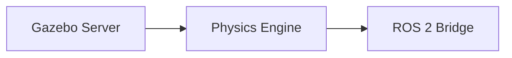

# Quickstart: Module 2 Development Environment

**Feature**: Module 2 - The Digital Twin (Gazebo & Unity)
**Date**: 2025-12-24
**Purpose**: Setup guide for contributors writing Module 2 content

---

## Prerequisites

Before setting up the Module 2 development environment, ensure you have:

1. **Module 1 Environment** (from Module 1 quickstart):
   - Node.js 18+ and npm
   - Docusaurus project (`frontend_book/`) running
   - Git repository cloned
   - Basic familiarity with Markdown/MDX

2. **System Requirements**:
   - **OS**: Ubuntu 22.04 (recommended) or Windows 11 with WSL2
   - **RAM**: 16GB minimum (32GB recommended for Unity)
   - **GPU**: Dedicated GPU recommended for Gazebo rendering and Unity
   - **Disk**: 20GB free space (Unity alone requires ~10GB)

---

## Step 1: Install ROS 2 Humble (For Testing Examples)

While writing Module 2 content, you'll need ROS 2 to test Gazebo/Unity examples.

### Option A: Native Installation (Ubuntu)

```bash
# Add ROS 2 repository
sudo apt update && sudo apt install software-properties-common
sudo add-apt-repository universe
sudo apt update && sudo apt install curl -y
sudo curl -sSL https://raw.githubusercontent.com/ros/rosdistro/master/ros.key -o /usr/share/keyrings/ros-archive-keyring.gpg

echo "deb [arch=$(dpkg --print-architecture) signed-by=/usr/share/keyrings/ros-archive-keyring.gpg] http://packages.ros.org/ros2/ubuntu $(. /etc/os-release && echo $UBUNTU_CODENAME) main" | sudo tee /etc/apt/sources.list.d/ros2.list > /dev/null

# Install ROS 2 Humble
sudo apt update
sudo apt install ros-humble-desktop -y

# Source ROS 2
echo "source /opt/ros/humble/setup.bash" >> ~/.bashrc
source ~/.bashrc
```

### Option B: Docker (Cross-Platform)

```bash
# Pull ROS 2 Humble image
docker pull osrf/ros:humble-desktop

# Run container with GUI support
docker run -it --rm \
  --name ros2-humble \
  -e DISPLAY=$DISPLAY \
  -v /tmp/.X11-unix:/tmp/.X11-unix \
  -v $(pwd):/workspace \
  osrf/ros:humble-desktop \
  bash
```

---

## Step 2: Install Gazebo (Fortress or Harmonic)

### Install Gazebo Fortress (Stable, ROS 2 Humble Compatible)

```bash
# Add Gazebo repository
sudo sh -c 'echo "deb http://packages.osrfoundation.org/gazebo/ubuntu-stable `lsb_release -cs` main" > /etc/apt/sources.list.d/gazebo-stable.list'
wget https://packages.osrfoundation.org/gazebo.key -O - | sudo apt-key add -

# Install Gazebo Fortress
sudo apt update
sudo apt install gz-fortress -y

# Install ROS 2 - Gazebo integration
sudo apt install ros-humble-ros-gz -y

# Test installation
gz sim
```

**Expected Result**: Gazebo GUI opens with empty world

---

## Step 3: Install Unity 2022.3 LTS

### 1. Install Unity Hub

```bash
# Download Unity Hub (Linux)
wget https://public-cdn.cloud.unity3d.com/hub/prod/UnityHub.AppImage
chmod +x UnityHub.AppImage
./UnityHub.AppImage
```

**Windows/Mac**: Download Unity Hub from https://unity.com/download

### 2. Install Unity 2022.3 LTS

1. Open Unity Hub
2. Go to "Installs" tab
3. Click "Add" → Select "2022.3 LTS" (latest patch)
4. Select modules:
   - **Linux Build Support** (if on Windows/Mac)
   - **Documentation** (optional)
5. Install (this will take 10-30 minutes)

### 3. Create Test Project

1. Unity Hub → "Projects" tab
2. "New Project" → Select "3D (URP)" template
3. Name: "ros2-unity-test"
4. Click "Create"

**Expected Result**: Unity Editor opens with empty 3D scene

---

## Step 4: Install Unity Robotics Hub

### 1. Add Unity Robotics Hub Package

In Unity Editor:

1. **Window** → **Package Manager**
2. Click **+** (top-left) → **Add package from git URL**
3. Enter: `https://github.com/Unity-Technologies/ROS-TCP-Connector.git?path=/com.unity.robotics.ros-tcp-connector`
4. Wait for installation (1-2 minutes)
5. Repeat for URDF Importer:
   - **+** → **Add package from git URL**
   - Enter: `https://github.com/Unity-Technologies/URDF-Importer.git?path=/com.unity.robotics.urdf-importer`

### 2. Install ROS-TCP-Endpoint (ROS 2 Side)

```bash
# In ROS 2 workspace
cd ~/ros2_ws/src
git clone https://github.com/Unity-Technologies/ROS-TCP-Endpoint
cd ~/ros2_ws
colcon build --packages-select ros_tcp_endpoint
source install/setup.bash

# Test endpoint
ros2 run ros_tcp_endpoint default_server_endpoint
```

**Expected Result**: Server starts on `127.0.0.1:10000`

### 3. Test Connection

In Unity:

1. **Robotics** → **ROS Settings**
2. Set **ROS IP Address**: `127.0.0.1`
3. Set **ROS Port**: `10000`
4. Click "Connect" (green indicator appears)

---

## Step 5: Verify Docusaurus Development Environment

Navigate to the Docusaurus project:

```bash
cd frontend_book
npm install  # If not already installed
npm start    # Start dev server
```

**Expected Result**: Browser opens to `http://localhost:3000` showing the book

---

## Step 6: Create Module 2 Structure

```bash
# From repository root
cd frontend_book/docs

# Create Module 2 directory
mkdir -p module-2-simulation

# Create module files
touch module-2-simulation/index.md
touch module-2-simulation/01-gazebo-simulation.md
touch module-2-simulation/02-unity-digital-twin.md
touch module-2-simulation/03-sensor-simulation.md

# Create _category_.json for sidebar
cat > module-2-simulation/_category_.json << EOF
{
  "label": "Module 2: The Digital Twin",
  "position": 2,
  "link": {
    "type": "generated-index",
    "description": "Physics-based simulation and digital twins for humanoid robots using Gazebo and Unity."
  }
}
EOF

# Create images directory
mkdir -p ../static/img/module-2
```

---

## Step 7: Test Example Code (Validation)

Before publishing Module 2, all code examples must be tested:

### Test Gazebo Examples

```bash
# Test world file loading
gz sim path/to/example_world.world

# Test URDF spawning
ros2 run gazebo_ros spawn_entity.py -file path/to/humanoid.urdf -entity test_robot

# Test sensor data
ros2 topic echo /scan
ros2 topic echo /camera/depth/image_raw
```

### Test Unity Examples

1. Open Unity project
2. Create empty GameObject → Add script from example
3. Press Play
4. Verify ROS 2 topics: `ros2 topic list`

---

## Step 8: Markdown Linting

Install and run Markdown linter to catch formatting errors:

```bash
# Install markdownlint-cli
npm install -g markdownlint-cli

# Lint Module 2 content
markdownlint 'frontend_book/docs/module-2-simulation/*.md'

# Fix auto-fixable issues
markdownlint --fix 'frontend_book/docs/module-2-simulation/*.md'
```

---

## Development Workflow

### 1. Writing Content

```bash
# Start Docusaurus dev server (hot reload)
cd frontend_book
npm start

# Edit chapter files in docs/module-2-simulation/
# Browser auto-refreshes on save
```

### 2. Testing Code Examples

For each code example in the chapter:

1. **Gazebo**: Copy code to file → Run in Gazebo → Verify behavior
2. **Unity**: Create script in Unity → Test in Play mode → Verify ROS 2 integration
3. **Python**: Run node → Subscribe to topics → Verify output

### 3. Adding Diagrams

**Mermaid (Inline)**:
````markdown

````

**PNG (External)**:
1. Save PNG to `frontend_book/static/img/module-2/diagram-name.png`
2. Reference in Markdown: ``

### 4. Building for Production

```bash
cd frontend_book
npm run build  # Test production build
npm run serve  # Preview production build locally
```

---

## Troubleshooting

### Gazebo: "gz: command not found"

```bash
# Check installation
which gz

# If missing, reinstall
sudo apt install gz-fortress
```

### Unity: "ROS-TCP-Connector not found"

1. Verify Package Manager shows "ROS TCP Connector" installed
2. Restart Unity Editor
3. Check Console for errors (Window → Console)

### ROS-TCP-Endpoint: "Connection refused"

```bash
# Ensure endpoint is running
ros2 run ros_tcp_endpoint default_server_endpoint

# Check firewall (if using Docker)
docker run -p 10000:10000 ...
```

### Docusaurus: "Module not found"

```bash
cd frontend_book
rm -rf node_modules package-lock.json
npm install
npm start
```

---

## Optional: Advanced Setup

### GPU Passthrough for Docker (Linux)

```bash
# Install nvidia-docker2
distribution=$(. /etc/os-release;echo $ID$VERSION_ID)
curl -s -L https://nvidia.github.io/nvidia-docker/gpgkey | sudo apt-key add -
curl -s -L https://nvidia.github.io/nvidia-docker/$distribution/nvidia-docker.list | sudo tee /etc/apt/sources.list.d/nvidia-docker.list
sudo apt update && sudo apt install -y nvidia-docker2
sudo systemctl restart docker

# Run ROS 2 + Gazebo with GPU
docker run --gpus all -it osrf/ros:humble-desktop
```

### Cloud Development (AWS EC2)

1. Launch Ubuntu 22.04 instance (g4dn.xlarge for GPU)
2. Install ROS 2, Gazebo, Unity (headless for Unity)
3. Use X11 forwarding or VNC for GUI access

---

## Next Steps

1. **Read** existing Module 1 chapters to understand writing style
2. **Review** `specs/002-gazebo-unity-module2/contracts/*.md` for chapter outlines
3. **Start writing** Chapter 1 (Gazebo Simulation Basics)
4. **Test** all code examples before committing
5. **Iterate** based on feedback and build validation

---

## Support

- **ROS 2 Issues**: https://answers.ros.org/
- **Gazebo Issues**: https://gazebosim.org/docs
- **Unity Robotics Hub**: https://github.com/Unity-Technologies/Unity-Robotics-Hub/issues
- **Docusaurus**: https://docusaurus.io/docs

---

**You're ready to write Module 2 content!** 🚀
